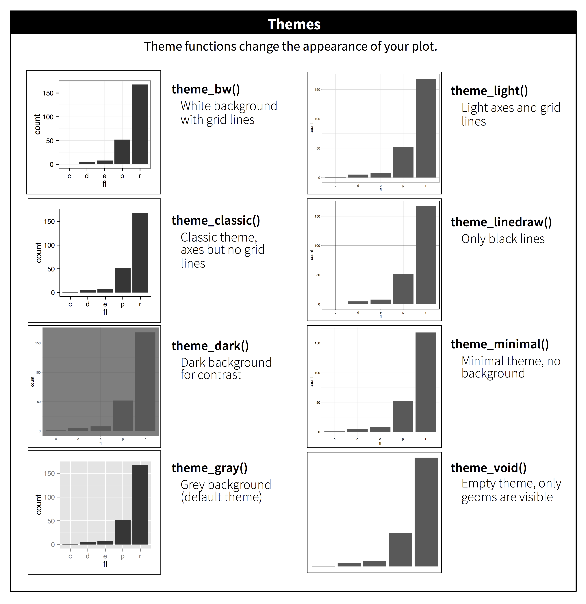

# Communication {#sec-communication}

```{r}
#| echo: false
source("_common.R")
```

## Introduction

Dans le @sec-exploratory-data-analysis, vous avez appris à utiliser les graphiques comme outils d'*exploration*.
Quand vous créez des graphiques exploratoires, vous savez---même avant de les regarder---quelles variables le graphique affichera.
Vous avez créé chaque graphique dans un but précis, vous pouviez y jeter un coup d'œil rapide, puis passer au suivant. Au cours de la plupart des analyses, vous produirez des dizaines, voire des centaines de graphiques, dont la plupart seront immédiatement mis de côté.

Maintenant que vous comprenez vos données, vous devez *communiquer* votre compréhension à d'autres.
Votre public ne disposera probablement pas des mêmes connaissances de base que vous et ne s'intéressera pas de près aux données. Pour aider vos interlocuteurs à se forger rapidement une bonne représentation mentale des données, vous devrez consacrer beaucoup d'efforts à rendre vos graphiques aussi explicites que possible.
Dans ce chapitre, vous apprendrez certains des outils que ggplot2 fournit pour faire cela.

Ce chapitre se concentre sur les outils dont vous avez besoin pour créer de bons graphiques.
Nous supposons que vous savez ce que vous voulez, et vous avez juste besoin de savoir comment le faire.
Pour cette raison, nous vous recommandons fortement de coupler ce chapitre avec un bon livre général sur la visualisation.
Nous aimons particulièrement [The Truthful Art](https://www.amazon.com/gp/product/0321934075/), par Albert Cairo.
Il n'enseigne pas la mécanique de création de visualisations, mais se concentre plutôt sur ce que vous devez penser pour créer des graphiques efficaces.

### Prérequis

Dans ce chapitre, nous nous concentrerons à nouveau sur ggplot2.
Nous utiliserons aussi un peu dplyr pour la manipulation des données, **scales** pour remplacer les divisions, étiquettes, transformations et palettes par défaut, et quelques packages d'extension ggplot2, incluant **ggrepel** ([https://ggrepel.slowkow.com](https://ggrepel.slowkow.com/)) par Kamil Slowikowski et **patchwork** ([https://patchwork.data-imaginist.com](https://patchwork.data-imaginist.com/)) par Thomas Lin Pedersen.
N'oubliez pas que vous devez installer ces packages avec `install.packages()` si vous ne les avez pas déjà.

```{r}
#| label: setup
#| message: false
library(tidyverse)
library(scales)
library(ggrepel)
library(patchwork)
```

## Étiquettes

Pour transformer un graphique exploratoire en graphique explicatif, le plus simple est de commencer par ajouter des étiquettes pertinentes.
Vous ajoutez des étiquettes avec la fonction `labs()`.

```{r}
#| message: false
#| fig-alt: |
#|   Nuage de points de l'efficacité énergétique sur autoroute par rapport à 
#|   la cylindrée du moteur, où les points sont colorés selon la classe de 
#|   voiture. Une courbe lisse suivant la trajectoire de la relation entre 
#|   l'efficacité énergétique sur autoroute et la cylindrée du moteur est 
#|   superposée. L'axe x est étiqueté « Cylindrée du moteur (L) » et l'axe y 
#|   « Efficacité énergétique sur autoroute (mpg) ». La légende est étiquetée 
#|   « Type de voiture ». Le graphique est intitulé « L'efficacité énergétique 
#|   diminue généralement avec la cylindrée du moteur ». Le sous-titre est 
#|   « Les deux places (voitures de sport) sont une exception en raison de 
#|   leur légèreté » et la note est « Données de fueleconomy.gov ».
ggplot(mpg, aes(x = displ, y = hwy)) +
  geom_point(aes(color = class)) +
  geom_smooth(se = FALSE) +
  labs(
    x = "Cylindrée du moteur (L)",
    y = "Efficacité énergétique sur autoroute (mpg)",
    color = "Type de voiture",
    title = "L'efficacité énergétique diminue généralement avec la \ncylindrée du moteur",
    subtitle = "Les voitures biplaces (voitures de sport) font exception en raison de leur \nfaible poids",
    caption = "Données de fueleconomy.gov"
  )
```

Le but d'un titre de graphique est de résumer la découverte principale.
Évitez les titres qui décrivent simplement ce qu'est le graphique, par ex., « Un nuage de points de la cylindrée du moteur par rapport à l'efficacité énergétique ».

Si vous devez ajouter plus de texte, il y a deux autres étiquettes utiles : `subtitle` ajoute des détails supplémentaires dans une police plus petite sous le titre et `caption` ajoute du texte en bas à droite du graphique, souvent utilisé pour décrire la source des données.
Vous pouvez aussi utiliser `labs()` pour remplacer les titres des axes et des légendes.
En général, c'est une bonne idée de remplacer les noms de variables courts par des descriptions plus détaillées et d'inclure les unités.

Il est possible d'utiliser des équations mathématiques à la place de chaînes de texte.
Remplacez simplement `""` par `quote()` et lisez les options disponibles dans `?plotmath` :

```{r}
#| fig-asp: 1
#| out-width: "50%"
#| fig-width: 3
#| fig-alt: |
#|   Nuage de points avec du texte mathématique sur les étiquettes des axes x 
#|   et y. L'étiquette de l'axe x dit x_i, l'étiquette de l'axe y dit somme 
#|   de x_i au carré, pour i de 1 à n.
df <- tibble(
  x = 1:10,
  y = cumsum(x^2)
)

ggplot(df, aes(x, y)) +
  geom_point() +
  labs(
    x = quote(x[i]),
    y = quote(sum(x[i] ^ 2, i == 1, n))
  )
```

### Exercices

1.  Créez un graphique sur les données d'efficacité énergétique avec des étiquettes `title`, `subtitle`, `caption`, `x`, `y` et `color` personnalisées.

2.  Recréez le graphique suivant en utilisant les données d'efficacité énergétique.
    Notez que les couleurs et les formes des points varient selon le type de chaîne de transmission.

    ```{r}
    #| echo: false
    #| fig-alt: |
    #|   Nuage de points de l'efficacité énergétique sur autoroute par rapport 
    #|   à celle en ville. Les formes et les couleurs des points sont déterminées 
    #|   par le type de chaîne de transmission.
    ggplot(mpg, aes(x = cty, y = hwy, color = drv, shape = drv)) +
      geom_point() +
      labs(
        x = "MPG en ville",
        y = "MPG sur autoroute",
        shape = "Type de\nchaîne de\ntransmission",
        color = "Type de\nchaîne de\ntransmission"
      )
    ```

3.  Prenez un graphique exploratoire que vous avez créé au cours du dernier mois, et ajoutez des titres informatifs pour faciliter sa compréhension.

## Annotations

En plus d'étiqueter les composants majeurs de votre graphique, il est souvent utile d'étiqueter des observations individuelles ou des groupes d'observations.
Le premier outil à votre disposition est `geom_text()`.
`geom_text()` est similaire à `geom_point()`, mais il a une esthétique supplémentaire : `label`.
Cela rend possible l'ajout d'étiquettes textuelles à vos graphiques.

Il existe deux sources possibles d'étiquettes.
Tout d'abord, vous devez avoir un tibble qui fournit les étiquettes.
Dans le graphique suivant, nous extrayons les voitures avec la plus grande cylindrée du moteur dans chaque type de chaîne de transmission et enregistrons leurs informations dans un nouveau data frame appelé `label_info`.

```{r}
label_info <- mpg |>
  group_by(drv) |>
  arrange(desc(displ)) |>
  slice_head(n = 1) |>
  mutate(
    drive_type = case_when(
      drv == "f" ~ "traction avant",
      drv == "r" ~ "traction arrière",
      drv == "4" ~ "traction intégrale"
    )
  ) |>
  select(displ, hwy, drv, drive_type)

label_info
```

Ensuite, nous utilisons ce nouveau data frame pour étiqueter directement les trois groupes afin de remplacer la légende par des étiquettes placées directement sur le graphique.
En utilisant les arguments `fontface` et `size`, nous pouvons personnaliser l'apparence des étiquettes textuelles.
Elles sont plus grandes que le reste du texte sur le graphique et en gras.
(`theme(legend.position = "none"`) désactive toutes les légendes --- nous en parlerons bientôt plus en détail.)

```{r}
#| fig-alt: |
#|   Nuage de points du kilométrage sur autoroute par rapport à la cylindrée 
#|   du moteur où les points sont colorés par type de chaîne de transmission. 
#|   Les courbes lisses pour chaque type de chaîne de transmission sont 
#|   superposées. Les étiquettes textuelles identifient les courbes comme 
#|   traction avant, traction arrière et traction intégrale.
ggplot(mpg, aes(x = displ, y = hwy, color = drv)) +
  geom_point(alpha = 0.3) +
  geom_smooth(se = FALSE) +
  geom_text(
    data = label_info, 
    aes(x = displ, y = hwy, label = drive_type),
    fontface = "bold", size = 5, hjust = "right", vjust = "bottom"
  ) +
  theme(legend.position = "none")
```

Notez l'utilisation de `hjust` (justification horizontale) et `vjust` (justification verticale) pour contrôler l'alignement de l'étiquette.

Cependant, le graphique annoté que nous avons créé ci-dessus est difficile à lire car les étiquettes se chevauchent les unes les autres et avec les points.
Nous pouvons utiliser la fonction `geom_label_repel()` du package ggrepel pour résoudre ces deux problèmes.
Ce package utile ajustera automatiquement les étiquettes pour qu'elles ne se chevauchent pas :

```{r}
#| fig-alt: |
#|   Nuage de points du kilométrage sur autoroute par rapport à la cylindrée 
#|   du moteur où les points sont colorés par type de chaîne de transmission. 
#|   Les courbes lisses pour chaque type de chaîne de transmission sont 
#|   superposées. Les étiquettes textuelles identifient les courbes comme 
#|   traction avant, traction arrière et traction intégrale. Les étiquettes 
#|   sont des boîtes avec un fond blanc et positionnées pour ne pas se chevaucher.
ggplot(mpg, aes(x = displ, y = hwy, color = drv)) +
  geom_point(alpha = 0.3) +
  geom_smooth(se = FALSE) +
  geom_label_repel(
    data = label_info, 
    aes(x = displ, y = hwy, label = drive_type),
    fontface = "bold", size = 5, nudge_y = 2
  ) +
  theme(legend.position = "none")
```

Vous pouvez aussi utiliser la même idée pour mettre en évidence certains points sur un graphique avec `geom_text_repel()` du package ggrepel.
Notez une autre technique utilisée ici : nous avons ajouté une deuxième couche de grands points creux pour mettre davantage en évidence les points étiquetés.

```{r}
#| fig-alt: |
#|   Nuage de points de l'efficacité énergétique sur autoroute par rapport à 
#|   la cylindrée du moteur. Les points où le kilométrage sur autoroute est 
#|   supérieur à 40 ainsi que supérieur à 20 avec une cylindrée supérieure à 
#|   5 sont rouges, avec un cercle rouge creux, et étiquetés avec le modèle 
#|   de la voiture.
potential_outliers <- mpg |>
  filter(hwy > 40 | (hwy > 20 & displ > 5))
  
ggplot(mpg, aes(x = displ, y = hwy)) +
  geom_point() +
  geom_text_repel(data = potential_outliers, aes(label = model)) +
  geom_point(data = potential_outliers, color = "red") +
  geom_point(
    data = potential_outliers,
    color = "red", size = 3, shape = "circle open"
  )
```

Souvenez-vous, en plus de `geom_text()` et `geom_label()`, vous avez de nombreuses autres geoms dans ggplot2 disponibles pour vous aider à annoter votre graphique.
Quelques idées :

-   Utilisez `geom_hline()` et `geom_vline()` pour ajouter des lignes de référence.
    Nous les rendons souvent épaisses (`linewidth = 2`) et blanches (`color = white`), et il vaut mieux les mettre sous la couche de données primaire.
    Cela permet de les repérer facilement, sans pour autant détourner l'attention des données.

-   Utilisez `geom_rect()` pour dessiner un rectangle autour des points d'intérêt.
    Les limites du rectangle sont définies par les esthétiques `xmin`, `xmax`, `ymin`, `ymax`.
    Sinon, consultez le [package ggforce](https://ggforce.data-imaginist.com/index.html) et plus précisement [`geom_mark_hull()`](https://ggforce.data-imaginist.com/reference/geom_mark_hull.html), qui vous permet d'annoter des sous-ensembles de points à l'aide d'enveloppes.

-   Utilisez `geom_segment()` avec l'argument `arrow` pour attirer l'attention sur un point avec une flèche.
    Utilisez les esthétiques `x` et `y` pour définir l'emplacement de départ, et `xend` et `yend` pour définir l'emplacement de fin.

Une autre fonction pratique pour ajouter des annotations aux graphiques est `annotate()`.
En règle générale, les geoms sont utiles pour mettre en évidence un sous-ensemble des données tandis que `annotate()` est utile pour ajouter un ou quelques éléments d'annotation à un graphique.

Pour démontrer l'utilisation de `annotate()`, créons du texte à ajouter à notre graphique.
Le texte est un peu long, donc nous utiliserons `stringr::str_wrap()` pour ajouter automatiquement des sauts de ligne en fonction du nombre de caractères que vous voulez par ligne :

```{r}
trend_text <- "Les plus grandes cylindrées tendent à avoir une plus faible efficacité énergétique." |>
  str_wrap(width = 30)
trend_text
```

Ensuite, nous ajoutons deux couches d'annotation : une avec une geom label et l'autre avec une geom segment.
Les esthétiques `x` et `y` dans les deux définissent où l'annotation doit commencer, et les esthétiques `xend` et `yend` dans l'annotation segment définissent l'emplacement de fin du segment.
Notez aussi que le segment est stylisé comme une flèche.

```{r}
#| fig-alt: |
#|   Nuage de points de l'efficacité énergétique sur autoroute par rapport à 
#|   la cylindrée du moteur. Une flèche rouge pointant vers le bas suit la 
#|   tendance des points et l'annotation placée à côté de la flèche lit 
#|   « Les plus grandes cylindrées tendent à avoir une plus faible efficacité 
#|   énergétique ». La flèche et le texte d'annotation sont rouges.
ggplot(mpg, aes(x = displ, y = hwy)) +
  geom_point() +
  annotate(
    geom = "label", x = 3.5, y = 38,
    label = trend_text,
    hjust = "left", color = "red"
  ) +
  annotate(
    geom = "segment",
    x = 3, y = 35, xend = 5, yend = 25, color = "red",
    arrow = arrow(type = "closed")
  )
```

L'annotation est un outil puissant pour communiquer les conclusions principales et les caractéristiques intéressantes de vos visualisations.
La seule limite est votre imagination (et votre patience pour positionner les annotations de manière esthétique) !

### Exercices

1.  Utilisez `geom_text()` avec des positions infinies pour placer le texte dans les quatre coins du graphique.

2.  Utilisez `annotate()` pour ajouter un geom_point au milieu de votre dernier graphique sans avoir à créer un tibble.
    Personnalisez la forme, la taille ou la couleur du point.

3.  Comment les étiquettes avec `geom_text()` interagissent-elles avec le facettage ?
    Comment pouvez-vous ajouter une étiquette à une seule facette ?
    Comment pouvez-vous mettre une étiquette différente dans chaque facette ?
    (Indice : Pensez au jeu de données qui est transmis à `geom_text()`.)

4.  Quels arguments de `geom_label()` contrôlent l'apparence de la boîte de fond ?

5.  Quels sont les quatre arguments de `arrow()` ?
    Comment fonctionnent-ils ?
    Créez une série de graphiques qui démontrent les options les plus importantes.

## Échelles

La troisième façon d'améliorer votre graphique pour faciliter la communication est d'ajuster les échelles (scales).
Les échelles contrôlent la façon dont les mappages esthétiques se manifestent visuellement.

### Échelles par défaut

Normalement, ggplot2 ajoute automatiquement les échelles pour vous.
Par exemple, quand vous tapez :

```{r}
#| label: default-scales
#| fig-show: hide
ggplot(mpg, aes(x = displ, y = hwy)) +
  geom_point(aes(color = class))
```

ggplot2 ajoute automatiquement les échelles par défaut en coulisse :

```{r}
#| fig-show: hide
ggplot(mpg, aes(x = displ, y = hwy)) +
  geom_point(aes(color = class)) +
  scale_x_continuous() +
  scale_y_continuous() +
  scale_color_discrete()
```

Notez le schéma de nommage pour les échelles : `scale_` suivi du nom de l'esthétique, puis `_`, puis le nom de l'échelle.
Les échelles par défaut sont nommées selon le type de variable auquel elles s'alignent : continu, discret, datetime ou date.
`scale_x_continuous()` place les valeurs numériques de `displ` sur une ligne de nombre continu sur l'axe x, `scale_color_discrete()` choisit les couleurs pour chaque `class` de voiture, etc.
Il y a beaucoup d'échelles non standard que vous apprendrez ci-dessous.

Les échelles par défaut ont été soigneusement choisies pour bien fonctionner sur une large gamme d'entrées.
Néanmoins, vous pourriez vouloir remplacer les valeurs par défaut pour deux raisons :

-   Pour ajuster certains des paramètres de l'échelle par défaut.
    Cela vous permet de faire des choses comme changer les divisions sur les axes, ou les étiquettes clés sur la légende.

-   Pour remplacer complètement l'échelle et utiliser un algorithme complètement différent.
    Souvent, vous pouvez faire mieux que le défaut parce que vous connaissez les données.

### Graduations d'axes et clés de légende

Collectivement, les axes et les légendes s'appellent des **guides**.
Les axes sont utilisés pour les esthétiques x et y ; les légendes sont utilisées pour tout le reste.

Il y a deux arguments principaux qui affectent l'apparence des graduations sur les axes et les clés sur la légende : `breaks` et `labels`.
Breaks contrôle la position des graduations, ou les valeurs associées aux clés.
Labels contrôle l'étiquette texte associée à chaque graduation/clé.
L'utilisation la plus courante de `breaks` est de remplacer la valeur par défaut :

```{r}
#| fig-alt: |
#|   Nuage de points de l'efficacité énergétique sur autoroute par rapport 
#|   à la cylindrée du moteur, coloré par chaîne de transmission. L'axe y a 
#|   des divisions commençant à 15 et se terminant à 40, augmentant par 5.
ggplot(mpg, aes(x = displ, y = hwy, color = drv)) +
  geom_point() +
  scale_y_continuous(breaks = seq(15, 40, by = 5)) 
```

Vous pouvez utiliser `labels` de la même manière (un vecteur de caractères de la même longueur que `breaks`), mais vous pouvez aussi le définir à `NULL` pour supprimer complètement les étiquettes.
Cela peut être utile pour les cartes, ou pour publier des graphiques où vous ne pouvez pas partager les nombres absolus.
Vous pouvez aussi utiliser `breaks` et `labels` pour contrôler l'apparence des légendes.
Pour les échelles discrètes des variables catégoriques, `labels` peut être une liste des noms de niveaux existants et des étiquettes souhaitées.

```{r}
#| fig-alt: |
#|   Nuage de points de l'efficacité énergétique sur autoroute par rapport 
#|   à la cylindrée du moteur, coloré par chaîne de transmission. Les axes x 
#|   et y n'ont pas d'étiquettes aux graduations. La légende a des étiquettes 
#|   personnalisées : traction intégrale, avant, arrière.
ggplot(mpg, aes(x = displ, y = hwy, color = drv)) +
  geom_point() +
  scale_x_continuous(labels = NULL) +
  scale_y_continuous(labels = NULL) +
  scale_color_discrete(labels = c("4" = "traction intégrale", "f" = "traction avant", "r" = "traction arrière"))
```

L'argument `labels` couplé aux fonctions d'étiquetage du package scales est aussi utile pour formater les nombres en tant que devise, pourcentage, etc.
Le graphique de gauche montre l'étiquetage par défaut avec `label_dollar()`, qui ajoute un signe dollar ainsi qu'une virgule séparatrice des milliers.
Le graphique de droite ajoute une personnalisation supplémentaire en divisant les valeurs en dollars par 1 000 et en ajoutant un suffixe « K » (pour « milliers ») ainsi qu'en ajoutant des divisions personnalisées.
Notez que `breaks` est dans l'échelle par défaut des données.

```{r}
#| layout-ncol: 2
#| fig-width: 4
#| fig-alt: |
#|   Two side-by-side box plots of price versus cut of diamonds. The outliers 
#|   are transparent. On both plots the x-axis labels are formatted as dollars.
#|   The x-axis labels on the left plot start at $0 and go to $15,000, increasing 
#|   by $5,000. The x-axis labels on the right plot start at $1K and go to 
#|   $19K, increasing by $6K. 
# Left
ggplot(diamonds, aes(x = price, y = cut)) +
  geom_boxplot(alpha = 0.05) +
  scale_x_continuous(labels = label_dollar())

# Right
ggplot(diamonds, aes(x = price, y = cut)) +
  geom_boxplot(alpha = 0.05) +
  scale_x_continuous(
    labels = label_dollar(scale = 1/1000, suffix = "K"), 
    breaks = seq(1000, 19000, by = 6000)
  )
```

Une autre fonction d'étiquetage pratique est `label_percent()`:

```{r}
#| fig-alt: |
#|   Segmented bar plots of cut, filled with levels of clarity. The y-axis 
#|   labels start at 0% and go to 100%, increasing by 25%. The y-axis label 
#|   name is "Percentage".
ggplot(diamonds, aes(x = cut, fill = clarity)) +
  geom_bar(position = "fill") +
  scale_y_continuous(name = "Percentage", labels = label_percent())
```

`breaks` peut également servir lorsque l'on dispose d'un nombre relativement faible de points de données et que l'on souhaite mettre en évidence l'emplacement exact des observations. 
Prenons par exemple ce graphique qui montre les dates de début et de fin du mandat de chaque président américain.

```{r}
#| fig-alt: |
#|   Line plot of id number of presidents versus the year they started their 
#|   presidency. Start year is marked with a point and a segment that starts 
#|   there and ends at the end of the presidency. The x-axis labels are 
#|   formatted as two digit years starting with an apostrophe, e.g., '53.
presidential |>
  mutate(id = 33 + row_number()) |>
  ggplot(aes(x = start, y = id)) +
  geom_point() +
  geom_segment(aes(xend = end, yend = id)) +
  scale_x_date(name = NULL, breaks = presidential$start, date_labels = "'%y")
```

Notez que pour l'argument `breaks`, nous avons extrait la variable `start` sous forme de vecteur avec `presidential$start`, car il n'est pas possible d'effectuer un mappage esthétique pour cet argument. 
Notez également que la spécification des paliers et des étiquettes pour les échelles de date et d'heure est légèrement différente :

-   `date_labels` prend le même format que la fonction `parse_datetime()`.

-   `date_breaks` (non représenté ici) prend une chaîne de caractères telle que "2 days" or "1 month".

### Disposition de la légende

Vous utiliserez le plus souvent `breaks` et `labels` pour ajuster les axes.
Bien qu'ils fonctionnent aussi pour les légendes, il y a d'autres techniques que vous êtes plus susceptible d'utiliser.

Pour contrôler la position générale de la légende, vous devez utiliser un paramètre `theme()`.
Nous reviendrons aux thèmes à la fin du chapitre, mais en bref, ils contrôlent les parties du graphique qui ne sont pas liées aux données.
Le paramètre de thème `legend.position` contrôle où la légende est dessinée :

```{r}
#| layout-ncol: 2
#| fig-width: 4
#| fig-alt: |
#|   Quatre nuages de points de l'efficacité énergétique sur autoroute par 
#|   rapport à la cylindrée du moteur, où les points sont colorés en fonction 
#|   de la classe de voiture. Dans le sens des aiguilles d'une montre, la 
#|   légende est placée à droite, à gauche, en bas et en haut du graphique.
base <- ggplot(mpg, aes(x = displ, y = hwy)) +
  geom_point(aes(color = class))

base + theme(legend.position = "right") # le défaut
base + theme(legend.position = "left")
base + 
  theme(legend.position = "top") +
  guides(color = guide_legend(nrow = 3))
base + 
  theme(legend.position = "bottom") +
  guides(color = guide_legend(nrow = 3))
```

Si votre graphique est court et large, placez la légende en haut ou en bas, et s'il est haut et étroit, placez la légende à gauche ou à droite.
Vous pouvez aussi utiliser `legend.position = "none"` pour supprimer complètement l'affichage de la légende.

Pour contrôler l'affichage des légendes individuelles, utilisez `guides()` avec `guide_legend()` ou `guide_colorbar()`.
L'exemple suivant montre deux paramètres importants : contrôler le nombre de lignes que la légende utilise avec `nrow`, et remplacer l'une des esthétiques pour rendre les points plus grands.
Cela est particulièrement utile si vous avez utilisé un `alpha` faible pour afficher de nombreux points sur un graphique.

```{r}
#| fig-alt: |
#|   Nuage de points de l'efficacité énergétique sur autoroute par rapport 
#|   à la cylindrée du moteur, où les points sont colorés en fonction de la 
#|   classe de voiture. Une courbe lisse est superposée sur le graphique. 
#|   La légende est en bas et les classes sont listées horizontalement en 
#|   deux lignes. Les points dans la légende sont plus grands que les points 
#|   du graphique.
ggplot(mpg, aes(x = displ, y = hwy)) +
  geom_point(aes(color = class)) +
  geom_smooth(se = FALSE) +
  theme(legend.position = "bottom") +
  guides(color = guide_legend(nrow = 2, override.aes = list(size = 4)))
```

Notez que le nom de l'argument dans `guides()` correspond au nom de l'esthétique, comme dans `labs()`.

### Remplacer une échelle

Au lieu de se contenter d'apporter quelques petites modifications aux détails, vous pouvez complètement remplacer l'échelle.
Il y a deux types d'échelles que vous êtes plus susceptible de vouloir changer : les échelles de position continues et les échelles de couleur.
Heureusement, les mêmes principes s'appliquent à toutes les autres esthétiques, donc une fois que vous maîtrisez la position et la couleur, vous serez en mesure de maîtriser rapidement d'autres remplacements d'échelle.

Il est très utile de représenter graphiquement les transformations de votre variable.
Par exemple, il est plus facile de voir la relation précise entre `carat` et `price` si nous les transformons en logarithme :

```{r}
#| fig-align: default
#| layout-ncol: 2
#| fig-width: 3
#| fig-alt: |
#|   Deux graphiques du prix par rapport au carat des diamants. Données 
#|   regroupées et la couleur des rectangles représentant chaque classe basée 
#|   sur le nombre de points qui tombent dans cette classe. Dans le graphique 
#|   à droite, les valeurs de prix et carat sont en logarithme et les étiquettes 
#|   des axes affichent les valeurs en logarithme.
# Gauche
ggplot(diamonds, aes(x = carat, y = price)) +
  geom_bin2d()

# Droite
ggplot(diamonds, aes(x = log10(carat), y = log10(price))) +
  geom_bin2d()
```

Cependant, l'inconvénient de cette transformation est que les axes sont maintenant étiquetés avec les valeurs transformées, ce qui rend difficile l'interprétation du graphique.
Au lieu de faire la transformation dans le mappage esthétique, nous pouvons plutôt le faire avec scale.
C'est visuellement identique, sauf que les axes sont étiquetés à l'échelle de données d'origine.

```{r}
#| fig-alt: |
#|   Graphique du prix par rapport au carat des diamants. Données regroupées 
#|   et la couleur des rectangles représentant chaque classe basée sur le 
#|   nombre de points qui tombent dans cette classe. Les étiquettes des axes 
#|   sont à l'échelle de données originale.
ggplot(diamonds, aes(x = carat, y = price)) +
  geom_bin2d() + 
  scale_x_log10() + 
  scale_y_log10()
```

Une autre échelle qui est fréquemment personnalisée est la couleur.
L'échelle catégorique par défaut choisit les couleurs qui sont régulièrement espacées autour de la roue chromatique.
Les alternatives utiles sont les échelles ColorBrewer qui ont été ajustées à la main pour mieux fonctionner pour les personnes avec des types courants de daltonisme.
Les deux graphiques ci-dessous se ressemblent, mais il y a assez de différence dans les teintes de rouge et de vert pour que les points à droite puissent être distingués même par les personnes atteintes de daltonisme rouge-vert.[^communication-1]

[^communication-1]: Vous pouvez utiliser un outil comme [SimDaltonism](https://michelf.ca/projects/sim-daltonism/) pour simuler le daltonisme pour tester ces images.

```{r}
#| fig-align: default
#| layout-ncol: 2
#| fig-width: 3
#| fig-alt: |
#|   Deux nuages de points du kilométrage sur autoroute par rapport à la 
#|   cylindrée du moteur, où les points sont colorés par type de chaîne de 
#|   transmission. Le graphique de gauche utilise la palette de couleurs par 
#|   défaut ggplot2 et le graphique de droite utilise une palette de couleurs 
#|   différente.
ggplot(mpg, aes(x = displ, y = hwy)) +
  geom_point(aes(color = drv))

ggplot(mpg, aes(x = displ, y = hwy)) +
  geom_point(aes(color = drv)) +
  scale_color_brewer(palette = "Set1")
```

N'oubliez pas les techniques plus simples pour améliorer l'accessibilité.
S'il n'y a que quelques couleurs, vous pouvez ajouter un mappage de forme redondant.
Cela aidera également à assurer que votre graphique est interprétable en noir et blanc.

```{r}
#| fig-alt: |
#|   Nuage de points du kilométrage sur autoroute par rapport à la cylindrée 
#|   du moteur, où la couleur et la forme des points sont basées sur le type 
#|   de chaîne de transmission. La palette de couleurs n'est pas la palette 
#|   par défaut ggplot2.
ggplot(mpg, aes(x = displ, y = hwy)) +
  geom_point(aes(color = drv, shape = drv)) +
  scale_color_brewer(palette = "Set1")
```

Les échelles ColorBrewer sont documentées en ligne à <https://colorbrewer2.org/> et rendues disponibles en R via le package **RColorBrewer**, par Erich Neuwirth.
La @fig-brewer montre la liste complète de toutes les palettes.
Les palettes séquentielles (en haut) et divergentes (en bas) sont particulièrement utiles si vos valeurs catégoriques sont ordonnées, ou ont un « milieu ».
Cela se produit souvent si vous avez utilisé `cut()` pour transformer une variable continue en variable catégorique.

```{r}
#| label: fig-brewer
#| echo: false
#| fig-cap: Toutes les échelles colorBrewer.
#| fig-asp: 2.5
#| fig-alt: |
#|   Toutes les échelles colorBrewer. Un groupe va des couleurs claires aux 
#|   couleurs foncées. Un autre groupe est un ensemble de couleurs non 
#|   ordinales. Et le dernier groupe a des échelles divergentes (du foncé au 
#|   clair au foncé à nouveau). Au sein de chaque ensemble, il y a un certain 
#|   nombre de palettes.
par(mar = c(0, 3, 0, 0))
RColorBrewer::display.brewer.all()
```

Quand vous avez un mappage prédéfini entre les valeurs et les couleurs, utilisez `scale_color_manual()`.
Par exemple, si nous mappons le parti présidentiel à la couleur, nous voulons utiliser le mappage standard du rouge pour les Républicains et du bleu pour les Démocrates.
Une approche pour assigner ces couleurs est l'utilisation de codes couleur hexadécimaux :

```{r}
#| fig-alt: |
#|   Graphique linéaire du numéro d'identité des présidents par rapport à 
#|   l'année où ils ont commencé leur présidence. L'année de début est marquée 
#|   avec un point et un segment qui commence là et se termine à la fin de la 
#|   présidence. Les présidents Démocrates sont représentés en bleu et les 
#|   Républicains en rouge.
presidential |>
  mutate(id = 33 + row_number()) |>
  ggplot(aes(x = start, y = id, color = party)) +
  geom_point() +
  geom_segment(aes(xend = end, yend = id)) +
  scale_color_manual(values = c(Republican = "#E81B23", Democratic = "#00AEF3"))
```

Pour les couleurs continues, vous pouvez utiliser le built-in `scale_color_gradient()` ou `scale_fill_gradient()`.
Si vous avez une échelle divergente, vous pouvez utiliser `scale_color_gradient2()`.
Cela vous permet de donner, par exemple, des couleurs différentes aux valeurs positives et négatives.
C'est parfois aussi utile si vous voulez distinguer les points au-dessus ou au-dessous de la moyenne.

Une autre option est d'utiliser les échelles de couleur viridis.
Les concepteurs, Nathaniel Smith et Stéfan van der Walt, ont soigneusement élaboré des schémas de couleur continues qui sont perceptibles par les personnes atteintes de différentes formes de daltonisme et qui présentent une uniformité perceptuelle tant en couleur qu’en noir et blanc.
Ces échelles sont disponibles sous forme de palettes continues (`c`), discrètes (`d`) et groupées (`b`) dans ggplot2.

```{r}
#| fig-align: default
#| layout-ncol: 2
#| fig-width: 3
#| fig-asp: 0.75
#| fig-alt: |
#|   Three hex plots where the color of the hexes show the number of observations 
#|   that fall into that hex bin. The first plot uses the default, continuous 
#|   ggplot2 scale. The second plot uses the viridis, continuous scale, and the 
#|   third plot uses the viridis, binned scale.
df <- tibble(
  x = rnorm(10000),
  y = rnorm(10000)
)

ggplot(df, aes(x, y)) +
  geom_hex() +
  coord_fixed() +
  labs(title = "Default, continuous", x = NULL, y = NULL)

ggplot(df, aes(x, y)) +
  geom_hex() +
  coord_fixed() +
  scale_fill_viridis_c() +
  labs(title = "Viridis, continuous", x = NULL, y = NULL)

ggplot(df, aes(x, y)) +
  geom_hex() +
  coord_fixed() +
  scale_fill_viridis_b() +
  labs(title = "Viridis, binned", x = NULL, y = NULL)
```

Notez que toutes les échelles de couleurs existent en deux variantes : `scale_color_*()` et `scale_fill_*()`, respectivement pour les esthétiques `color` et `fill` (les échelles de couleurs sont disponibles aussi bien en orthographe britannique qu'américaine).

### Zoom

Il y a trois façons de contrôler les limites du graphique :

1.  Ajuster les données qui sont tracées.
2.  Définir les limites dans chaque échelle.
3.  Définir `xlim` et `ylim` dans `coord_cartesian()`.

Nous démontrerons ces options dans une série de graphiques.
Le graphique de gauche montre la relation entre la cylindrée du moteur et l'efficacité énergétique, colorée par type de chaîne de transmission.
Le graphique de droite montre les mêmes variables, mais sur un sous-ensemble des données qui sont tracées.
Le sous-ensemble des données a affecté les échelles x et y ainsi que la courbe.

```{r}
#| layout-ncol: 2
#| fig-width: 4
#| message: false
#| fig-alt: |
#|   On the left, scatterplot of highway mileage vs. displacement 
#|   where points are colored by drive type. 
#|   The smooth curve overlaid shows a decreasing, and then 
#|   increasing trend, like a hockey stick. On the right, same variables 
#|   are plotted with displacement ranging only from 5 to 6 and highway 
#|   mileage ranging only from 10 to 25. The smooth curve overlaid shows a 
#|   trend that's slightly increasing first and then decreasing. 
# Left
ggplot(mpg, aes(x = displ, y = hwy)) +
  geom_point(aes(color = drv)) +
  geom_smooth()

# Right
mpg |>
  filter(displ >= 5 & displ <= 6 & hwy >= 10 & hwy <= 25) |>
  ggplot(aes(x = displ, y = hwy)) +
  geom_point(aes(color = drv)) +
  geom_smooth()
```

Comparons-les aux deux graphiques ci-dessous où celui de gauche fixe les `limits` sur les échelles individuelles et celui de droite les fixe dans `coord_cartesian()`.
Nous pouvons voir que réduire les limites équivaut à faire un sous-ensemble de données.
Par conséquent, pour zoomer sur une région du graphique, il est généralement préférable d'utiliser `coord_cartesian()`.

```{r}
#| layout-ncol: 2
#| fig-width: 4
#| message: false
#| warning: false
#| fig-alt: |
#|   On the left, scatterplot of highway mileage vs. displacement, with 
#|   displacement ranging from 5 to 6 and highway mileage ranging from 
#|   10 to 25. The smooth curve overlaid shows a trend that's slightly 
#|   increasing first and then decreasing. On the right, same variables 
#|   are plotted with the same limits, however the smooth curve overlaid
#|   shows a relatively flat trend with a slight increase at the end.
# Left
ggplot(mpg, aes(x = displ, y = hwy)) +
  geom_point(aes(color = drv)) +
  geom_smooth() +
  scale_x_continuous(limits = c(5, 6)) +
  scale_y_continuous(limits = c(10, 25))

# Right
ggplot(mpg, aes(x = displ, y = hwy)) +
  geom_point(aes(color = drv)) +
  geom_smooth() +
  coord_cartesian(xlim = c(5, 6), ylim = c(10, 25))
```

D'un autre côté, définir les `limits` sur les échelles individuelles est généralement plus utile si vous voulez *élargir* les limites, par exemple pour harmoniser les échelles entre différents graphiques.
Par exemple, si nous extrayons deux classes de voitures et les traçons séparément, il est difficile de comparer les graphiques parce que les trois échelles (l'axe des x, l'axe des y et l'esthétique couleur) ont des plages différentes.

```{r}
#| layout-ncol: 2
#| fig-width: 4
#| fig-alt: |
#|   On the left, a scatterplot of highway mileage vs. displacement of SUVs.
#|   On the right, a scatterplot of the same variables for compact cars.
#|   Points are colored by drive type for both plots. Among SUVs more of 
#|   the cars are 4-wheel drive and the others are rear-wheel drive, while 
#|   among compact cars more of the cars are front-wheel drive and the others 
#|   are 4-wheel drive. SUV plot shows a clear negative relationship 
#|   between highway mileage and displacement while in the compact cars plot 
#|   the relationship is much flatter.
suv <- mpg |> filter(class == "suv")
compact <- mpg |> filter(class == "compact")

# Left
ggplot(suv, aes(x = displ, y = hwy, color = drv)) +
  geom_point()

# Right
ggplot(compact, aes(x = displ, y = hwy, color = drv)) +
  geom_point()
```

Une façon de résoudre ce problème est de définir les mêmes échelles sur plusieurs graphiques, en entraînant les échelles avec les `limits` de l'ensemble des données.

```{r}
#| layout-ncol: 2
#| fig-width: 4
#| fig-alt: |
#|   On the left, a scatterplot of highway mileage vs. displacement of SUVs.
#|   On the right, a scatterplot of the same variables for compact cars.
#|   Points are colored by drive type for both plots. Both plots are plotted 
#|   on the same scale for highway mileage, displacement, and drive type, 
#|   resulting in the legend showing all three types (front, rear, and 4-wheel 
#|   drive) for both plots even though there are no front-wheel drive SUVs and 
#|   no rear-wheel drive compact cars. Since the x and y scales are the same, 
#|   and go well beyond minimum or maximum highway mileage and displacement, 
#|   the points do not take up the entire plotting area.
x_scale <- scale_x_continuous(limits = range(mpg$displ))
y_scale <- scale_y_continuous(limits = range(mpg$hwy))
col_scale <- scale_color_discrete(limits = unique(mpg$drv))

# Left
ggplot(suv, aes(x = displ, y = hwy, color = drv)) +
  geom_point() +
  x_scale +
  y_scale +
  col_scale

# Right
ggplot(compact, aes(x = displ, y = hwy, color = drv)) +
  geom_point() +
  x_scale +
  y_scale +
  col_scale
```

Dans ce cas particulier, vous auriez simplement pu utiliser la facettisation, mais cette technique est utile plus largement, par exemple dans le cas où vous voulez répartir des graphiques sur plusieurs pages d'un rapport.

### Exercices

1.  Pourquoi le code suivant ne remplace-t-il pas l'échelle par défaut ?

    ```{r}
    #| fig-show: hide
    df <- tibble(
      x = rnorm(10000),
      y = rnorm(10000)
    )

    ggplot(df, aes(x, y)) +
      geom_hex() +
      scale_color_gradient(low = "white", high = "red") +
      coord_fixed()
    ```

2.  Quel est le premier argument de chaque échelle ?
    Comment se compare-t-il à `labs()` ?

3.  Modifiez l'affichage des mandats présidentiels en :

    a.  Combinant les deux variantes qui personnalisent les couleurs et les coupures de l'axe x.
    b.  Améliorant l'affichage de l'axe y.
    c.  Étiquetant chaque mandat avec le nom du président.
    d.  Ajoutant des étiquettes de graphique informatives.
    e.  Plaçant des coupures tous les 4 ans (c'est plus difficile qu'il n'y paraît !).

4.  D'abord, créez le graphique suivant.
    Ensuite, modifiez le code en utilisant `override.aes` pour rendre la légende plus facile à lire.

    ```{r}
    #| fig-show: hide
    ggplot(diamonds, aes(x = carat, y = price)) +
      geom_point(aes(color = cut), alpha = 1/20)
    ```

## Thèmes {#sec-themes}

Enfin, vous pouvez personnaliser les parties de votre graphique qui ne sont pas liées aux données avec un thème :

```{r}
#| message: false
#| fig-alt: |
#|   Nuage de points du kilométrage sur autoroute par rapport au déplacement 
#|   des voitures, coloré par classe de voiture. L'arrière-plan du graphique 
#|   est blanc, avec des lignes de grille grises.
ggplot(mpg, aes(x = displ, y = hwy)) +
  geom_point(aes(color = class)) +
  geom_smooth(se = FALSE) +
  theme_bw()
```

ggplot2 inclut les huit thèmes montrés en @fig-themes, avec `theme_gray()` comme défaut.[^communication-2]
Beaucoup plus sont inclus dans des packages supplémentaires comme **ggthemes** (<https://jrnold.github.io/ggthemes>), par Jeffrey Arnold.
Vous pouvez aussi créer vos propres thèmes, si vous essayez de reproduire un style corporatif ou journalistique particulier.

[^communication-2]: Beaucoup de gens se demandent pourquoi le thème par défaut a un arrière-plan gris.
    C'était un choix délibéré car il met les données en avant tout en rendant les lignes de grille visibles.
    Les lignes de grille blanches sont visibles (ce qui est important car elles aident considérablement les jugements de position), mais elles ont peu d'impact visuel et nous pouvons facilement les ignorer.
    L'arrière-plan gris donne au graphique une couleur typographique similaire au texte, assurant que les graphiques s'ajustent au flux d'un document sans jaillir avec un arrière-plan blanc brillant.
    Enfin, l'arrière-plan gris crée un champ de couleur continu qui assure que le graphique est perçu comme une seule entité visuelle.

```{r}
#| label: fig-themes
#| echo: false
#| fig-cap: Les huit thèmes intégrés à ggplot2.
#| fig-alt: |
#|   Huit graphiques en barres créés avec ggplot2, chacun avec l'un des 
#|   huit thèmes intégrés : theme_bw() - Fond blanc avec lignes de grille,
#|   theme_light() - Axes légers et lignes de grille, theme_classic() - Thème 
#|   classique, axes mais pas de lignes de grille, theme_linedraw() - Lignes 
#|   noires seulement, theme_dark() - Fond foncé pour le contraste, 
#|   theme_minimal() - Thème minimal, pas de fond, theme_gray() - Fond gris 
#|   (thème par défaut), theme_void() - Thème vide, seules les geoms sont visibles.

```

Il est aussi possible de contrôler les composants individuels de chaque thème, comme la taille et la couleur de la police utilisée pour l'axe y.
Nous avons déjà vu que `legend.position` contrôle où la légende est affichée.
Il y a de nombreux autres aspects de la légende qui peuvent être personnalisés avec `theme()`.
Par exemple, dans le graphique ci-dessous, nous changeons la direction de la légende et mettons une bordure noire autour.
Notez que la personnalisation des éléments de la boîte de légende et du titre du graphique du thème se font avec les fonctions `element_*()`.
Ces fonctions spécifient le style des composants non liés aux données, par ex., le texte du titre est en gras dans l'argument `face` de `element_text()` et la couleur de la bordure de la légende est définie dans l'argument `color` de `element_rect()`.
Les éléments de thème qui contrôlent la position du titre et du caption sont respectivement `plot.title.position` et `plot.caption.position`.
Dans le graphique suivant, ceux-ci sont définis à `"plot"` pour indiquer que ces éléments sont alignés à l'ensemble de la zone du graphique, au lieu de la boîte du graphique (par défaut).
Quelques autres composants `theme()` pertinents sont utilisés pour changer le placement du format du texte du titre et du caption.

```{r}
#| fig-alt: |
#|   Scatterplot of highway fuel efficiency versus engine size of cars, colored 
#|   by drive. The plot is titled 'Larger engine sizes tend to have lower fuel 
#|   economy' with the caption pointing to the source of the data, fueleconomy.gov.
#|   The caption and title are left justified, the legend is inside of the plot
#|   with a black border.
ggplot(mpg, aes(x = displ, y = hwy, color = drv)) +
  geom_point() +
  labs(
    title = "Larger engine sizes tend to have lower fuel economy",
    caption = "Source: https://fueleconomy.gov."
  ) +
  theme(
    legend.position = c(0.6, 0.7),
    legend.direction = "horizontal",
    legend.box.background = element_rect(color = "black"),
    plot.title = element_text(face = "bold"),
    plot.title.position = "plot",
    plot.caption.position = "plot",
    plot.caption = element_text(hjust = 0)
  )
```

Pour un aperçu de tous les composants `theme()`, consultez l'aide avec `?theme`.
Le [livre ggplot2](https://ggplot2-book.org/) est également un excellent endroit pour trouver tous les détails sur les thèmes.

### Exercices

1.  Choisissez un thème proposé par le package ggthemes et appliquez-le au dernier graphique que vous avez créé.
2.  Affichez les étiquettes des axes de votre graphique en bleu et en gras.

## Mise en page

Jusqu'à présent, nous avons parlé de la création et de la modification d'un seul graphique.
Et si vous aviez plusieurs graphiques que vous vouliez organiser d'une certaine manière ?
Le package patchwork vous permet de combiner des graphiques séparés dans un même graphique.
Nous avons chargé ce package plus tôt dans le chapitre.

Pour placer deux graphiques côte à côte, vous pouvez simplement les ajouter l'un à l'autre.
Notez que vous devez d'abord créer les graphiques et les enregistrer en tant qu'objets (dans l'exemple suivant, ils s'appellent `p1` et `p2`).
Ensuite, vous les placez côte à côte avec `+`.

```{r}
#| fig-width: 6
#| fig-asp: 0.5
#| fig-alt: |
#|   Deux graphiques (un nuage de points du kilométrage sur autoroute par 
#|   rapport à la cylindrée du moteur et des boîtes à moustaches côte à côte 
#|   du kilométrage sur autoroute par rapport à la chaîne de transmission) 
#|   placés côte à côte.
p1 <- ggplot(mpg, aes(x = displ, y = hwy)) + 
  geom_point() + 
  labs(title = "Graphique 1")
p2 <- ggplot(mpg, aes(x = drv, y = hwy)) + 
  geom_boxplot() + 
  labs(title = "Graphique 2")
p1 + p2
```

Il est important de noter que dans le bloc de code ci-dessus, nous n'avons pas utilisé une nouvelle fonction du package patchwork.
À la place, le package a étendu l'opérateur `+` avec une nouvelle fonctionnalité.

Vous pouvez aussi créer des mises en page complexes de graphiques avec patchwork.
Dans ce qui suit, `|` place `p1` et `p3` côte à côte et `/` déplace `p2` à la ligne suivante.

```{r}
#| fig-width: 6
#| fig-asp: 0.8
#| fig-alt: |
#|   Trois graphiques disposés de telle sorte que le premier et le troisième 
#|   graphique sont côte à côte et le deuxième graphique s'étend sous eux. 
#|   Le premier graphique est un nuage de points du kilométrage sur autoroute 
#|   par rapport à la cylindrée du moteur, le troisième graphique est un 
#|   nuage de points du kilométrage sur autoroute par rapport au kilométrage 
#|   en ville, et le deuxième graphique est des boîtes à moustaches côte à 
#|   côte du kilométrage sur autoroute par rapport à la chaîne de transmission.
p3 <- ggplot(mpg, aes(x = cty, y = hwy)) + 
  geom_point() + 
  labs(title = "Graphique 3")
(p1 | p3) / p2
```

De plus, patchwork vous permet de rassembler les légendes de plusieurs graphiques dans une légende commune, de personnaliser le placement de la légende ainsi que les dimensions des graphiques, et d'ajouter un titre commun, un sous-titre, un caption, etc. à vos graphiques.
Ci-dessous, nous créons 5 graphiques.
Nous avons désactivé les légendes sur les boîtes à moustaches et le nuage de points et avons rassemblé les légendes des graphiques de densité en haut du graphique avec `& theme(legend.position = "top")`.
Notez l'utilisation de l'opérateur `&` ici au lieu du `+` habituel.
C'est parce que nous modifions le thème du graphique patchwork, par opposition aux ggplots individuels.
La légende est placée en haut, à l'intérieur de `guide_area()`.
Enfin, nous avons aussi personnalisé les hauteurs des différents composants de notre patchwork : le guide a une hauteur de 1, les boîtes à moustaches 3, les graphiques de densité 2, et le nuage de points facetté 4.
Patchwork divise la zone que vous avez allouée à votre graphique en utilisant cette échelle et place les composants en conséquence.

```{r}
#| fig-width: 8
#| fig-asp: 1
#| fig-alt: |
#|   Cinq graphiques disposés de telle sorte que les deux premiers graphiques 
#|   sont côte à côte. Les graphiques trois et quatre sont sous eux. Et le 
#|   cinquième graphique s'étend sous eux. Le graphique patchwork est intitulé 
#|   « Kilométrage en ville et sur autoroute pour les voitures avec différentes 
#|   chaînes de transmission » et légendé « Source : https://fueleconomy.gov ». 
#|   Les deux premiers graphiques sont des boîtes à moustaches côte à côte. 
#|   Les graphiques 3 et 4 sont des graphiques de densité. Et le cinquième 
#|   graphique est un nuage de points facetté. Chacun de ces graphiques montre 
#|   des geoms colorées par chaîne de transmission, mais le graphique patchwork 
#|   n'a qu'une seule légende qui s'applique à tous, au-dessus des graphiques 
#|   et sous le titre.
p1 <- ggplot(mpg, aes(x = drv, y = cty, color = drv)) + 
  geom_boxplot(show.legend = FALSE) + 
  labs(title = "Graphique 1")

p2 <- ggplot(mpg, aes(x = drv, y = hwy, color = drv)) + 
  geom_boxplot(show.legend = FALSE) + 
  labs(title = "Graphique 2")

p3 <- ggplot(mpg, aes(x = cty, color = drv, fill = drv)) + 
  geom_density(alpha = 0.5) + 
  labs(title = "Graphique 3")

p4 <- ggplot(mpg, aes(x = hwy, color = drv, fill = drv)) + 
  geom_density(alpha = 0.5) + 
  labs(title = "Graphique 4")

p5 <- ggplot(mpg, aes(x = cty, y = hwy, color = drv)) + 
  geom_point(show.legend = FALSE) + 
  facet_wrap(~drv) +
  labs(title = "Graphique 5")

(guide_area() / (p1 + p2) / (p3 + p4) / p5) +
  plot_annotation(
    title = "Kilométrage en ville et sur autoroute pour les voitures avec différentes chaînes de transmission",
    caption = "Source : https://fueleconomy.gov."
  ) +
  plot_layout(
    guides = "collect",
    heights = c(1, 3, 2, 4)
    ) &
  theme(legend.position = "top")
```

Si vous souhaitez en savoir plus sur la combinaison et la mise en page de plusieurs graphiques avec patchwork, nous vous recommandons de consulter les guides sur le site web du package : <https://patchwork.data-imaginist.com>.

### Exercices

1.  Que se passe-t-il si vous omettez les parenthèses dans la mise en page du graphique suivant ?
    Pouvez-vous expliquer pourquoi cela se produit ?

    ```{r}
    #| fig-show: hide
    p1 <- ggplot(mpg, aes(x = displ, y = hwy)) + 
      geom_point() + 
      labs(title = "Graphique 1")
    p2 <- ggplot(mpg, aes(x = drv, y = hwy)) + 
      geom_boxplot() + 
      labs(title = "Graphique 2")
    p3 <- ggplot(mpg, aes(x = cty, y = hwy)) + 
      geom_point() + 
      labs(title = "Graphique 3")

    (p1 | p2) / p3
    ```

2.  En utilisant les trois graphiques de l'exercice précédent, recréez la mise en page patchwork suivante.

    ```{r}
    #| fig-width: 7
    #| fig-asp: 0.8
    #| echo: false
    #| fig-alt: |
    #|   Trois graphiques : Le graphique 1 est un nuage de points du kilométrage 
    #|   sur autoroute par rapport à la cylindrée du moteur. Le graphique 2 est 
    #|   des boîtes à moustaches côte à côte du kilométrage sur autoroute par 
    #|   rapport à la chaîne de transmission. Le graphique 3 est des boîtes à 
    #|   moustaches côte à côte du kilométrage en ville par rapport à la chaîne 
    #|   de transmission. Le graphique 1 est sur la première ligne. Les graphiques 
    #|   2 et 3 sont sur la ligne suivante, chacun s'étirant sur la moitié de la 
    #|   largeur du graphique 1. Le graphique 1 est étiqueté « Fig. A », le 
    #|   graphique 2 est étiqueté « Fig. B » et le graphique 3 est étiqueté « Fig. C ».
    p1 / (p2 + p3) +
      plot_annotation(
        tag_levels = c("A"), 
        tag_prefix = "Fig. ",
        tag_suffix = ":"
      )
    ```

## Résumé

Dans ce chapitre, vous avez appris à ajouter des étiquettes à votre graphique, comme le titre, le sous-titre et le caption, ainsi qu'à modifier les étiquettes des axes par défaut.
Vous avez découvert comment utiliser les annotations pour ajouter du texte informatif à votre graphique ou pour mettre en évidence des points de données spécifiques, comment personnaliser les échelles des axes et changer le thème de votre graphique.
Vous avez aussi appris à combiner plusieurs graphiques en un seul graphique en utilisant à la fois des mises en page simples et complexes.

Bien que vous ayez appris à créer de nombreux types différents de graphiques et à les personnaliser en utilisant diverses techniques, nous n'avons fait qu'effleurer la surface de ce que vous pouvez créer avec ggplot2.
Pour une compréhension complète de ggplot2, nous vous recommandons de consulter le livre [*ggplot2: Elegant Graphics for Data Analysis*](https://ggplot2-book.org).
D'autres ressources utiles sont le [*R Graphics Cookbook*](https://r-graphics.org) de Winston Chang et [*Fundamentals of Data Visualization*](https://clauswilke.com/dataviz/) de Claus Wilke.
