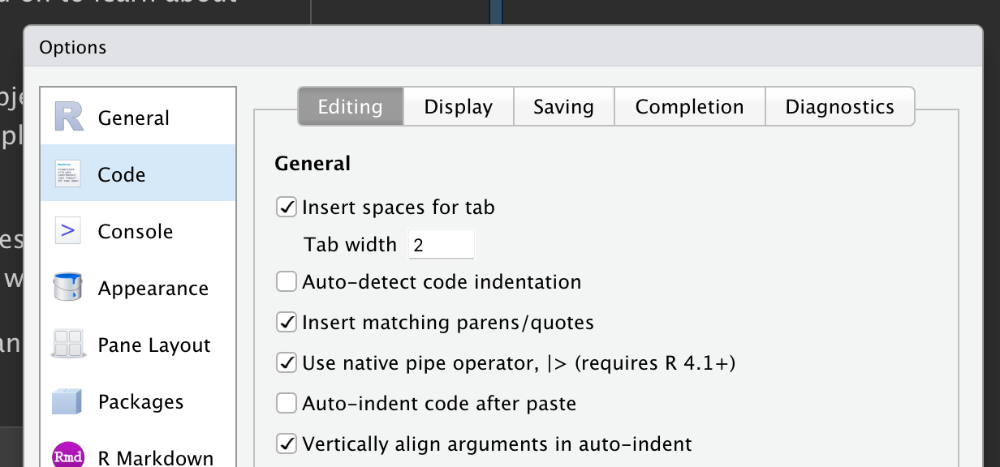

# Transformation de données {#sec-data-transform}

```{r}
#| echo: false
source("_common.R")
```

## Introduction

La visualisation est un outil important pour acquérir de la connaissance, mais il est rare que les données soient exactement sous la bonne forme pour créer le graphique souhaité.
Vous devrez souvent créer de nouvelles variables ou des statistiques pour répondre à vos questions avec vos données, vous voudrez peut-être simplement renommer les variables ou réorganiser les observations pour rendre les données un peu plus faciles à manipuler.
Vous apprendrez à faire tout cela (et bien plus !) dans ce chapitre, qui vous présentera la transformation de données à l'aide du package **dplyr** et un nouveau jeu de données sur les vols qui ont décollé de New York City en 2013.

L'objectif de ce chapitre est de vous donner un aperçu de tous les outils clés pour transformer un data frame.
Nous commencerons par les fonctions qui opèrent sur les lignes, puis sur les colonnes d'un data frame, puis reviendrons à la discussion du pipe, un outil important que vous utiliserez pour combiner les verbes.
Nous introduirons ensuite la capacité à travailler avec des groupes.
Nous terminerons le chapitre par une étude de cas qui met ces fonctions en action.
Dans les chapitres suivants, nous reviendrons sur ces fonctions plus en détail en commençant à explorer des types de données spécifiques (par exemple, les nombres, les chaînes de caractères, les dates).

### Conditions préalables

Dans ce chapitre, nous nous concentrerons sur le package dplyr, un autre membre central du tidyverse.
Nous illustrerons les idées clés à l'aide de données du package nycflights13 et utiliserons ggplot2 pour nous aider à comprendre les données.

```{r}
#| label: setup
library(nycflights13)
library(tidyverse)
```

Notez attentivement le message de conflits imprimé lorsque vous chargez le tidyverse.
Il vous dit que dplyr réécrit certaines fonctions dans R base.
Si vous voulez utiliser la version base de ces fonctions après avoir chargé dplyr, vous devrez utiliser leurs noms complets : `stats::filter()` et `stats::lag()`.
Jusqu'à présent, nous avons en grande partie ignoré d'où provient une fonction car cela n'a généralement pas d'importance.
Cependant, connaître le package peut vous aider à trouver de l'aide et à découvrir les fonctions connexes, donc quand nous devons être précis sur le package d'où provient une fonction, nous utiliserons la même syntaxe que R : `packagename::functionname()`.

### nycflights13

Pour explorer les verbes dplyr fondamentaux, nous utiliserons `nycflights13::flights`.
Ce jeu de données contient les `r format(nrow(nycflights13::flights), big.mark = ",")` vols qui ont décollé de New York en 2013.
Les données proviennent du [Bureau américain des statistiques des transports](https://www.transtats.bts.gov/DL_SelectFields.aspx?gnoyr_VQ=FGJ&QO_fu146_anzr=b0-gvzr) et sont documentées dans `?flights`.

```{r}
flights
```

`flights` est un tibble, un type spécial de data frame utilisé par le tidyverse pour éviter certains pièges courants.
La différence la plus importante entre les tibbles et les data frames est la manière dont les tibbles s'affichent ; ils sont conçus pour les jeux de données volumineux, de sorte qu'ils n'affichent que les premières lignes et uniquement les colonnes qui tiennent sur un écran.
Il existe quelques options pour tout voir.
Si vous utilisez RStudio, le plus pratique est probablement `View(flights)`, qui ouvre une vue interactive, déroulable et filtrable.
Sinon, vous pouvez utiliser `print(flights, width = Inf)` pour afficher toutes les colonnes, ou utiliser `glimpse()` :

```{r}
glimpse(flights)
```

Dans les deux vues, les noms de variables sont suivis d'abréviations qui vous indiquent le type de chaque variable : `<int>` est l'abréviation d'entier (*integer*), `<dbl>` pour double (alias nombres réels, *doble*), `<chr>` pour chaîne de caractères (alias texte, *character*), et `<dttm>` pour date-heure (*date-time*).
Ce sont des informations importantes car les opérations que vous pouvez effectuer sur une colonne dépendent beaucoup de son « type ».

### Principes de base de dplyr

Vous êtes sur le point d'apprendre les verbes dplyr principaux (fonctions), qui vous permettront de résoudre la grande majorité des défis de manipulation de données.
Mais avant de discuter de leurs différences individuelles, il vaut la peine de dire ce qu'ils ont en commun :

1.  Le premier argument est toujours un data frame.

2.  Les arguments suivants décrivent généralement les colonnes sur lesquelles opérer en utilisant les noms de variables (sans guillemets).

3.  La sortie est toujours un nouveau data frame.

Parce que chaque verbe fait une chose bien, la résolution de problèmes complexes nécessitera généralement de combiner plusieurs verbes, ce que nous ferons avec le pipe, `|>`.
Nous discuterons du pipe plus en détail dans la @sec-the-pipe, mais brièvement, le pipe prend ce qu'il y a à sa gauche et le transmet à la fonction à sa droite, de sorte que `x |> f(y)` équivaut à `f(x, y)`, et `x |> f(y) |> g(z)` équivaut à `g(f(x, y), z)`.
La façon la plus facile de prononcer le pipe est « puis ».
Cela permet de comprendre le code suivant même si vous n'avez pas encore appris les détails :

```{r}
#| eval: false
flights |>
  filter(dest == "IAH") |> 
  group_by(year, month, day) |> 
  summarize(
    arr_delay = mean(arr_delay, na.rm = TRUE)
  )
```

Les verbes dplyr sont organisés en quatre groupes en fonction de ce sur quoi ils opèrent : **lignes**, **colonnes**, **groupes**, ou **tables**.
Dans les sections suivantes, vous apprendrez les verbes les plus importants pour les lignes, les colonnes et les groupes.
Ensuite, nous reviendrons aux verbes de jointure qui opèrent sur les tables dans le @sec-joins.
Allons-y !

## Lignes

Les verbes les plus importants qui opèrent sur les lignes d'un jeu de données sont `filter()`, qui change les lignes présentes sans changer leur ordre, et `arrange()`, qui change l'ordre des lignes sans changer lesquelles sont présentes.
Les deux fonctions n'affectent que les lignes, et les colonnes restent inchangées.
Nous discuterons également de `distinct()` qui trouve les lignes avec des valeurs uniques.
Contrairement à `arrange()` et `filter()`, elle peut aussi modifier optionnellement les colonnes.

### `filter()`

`filter()` vous permet de conserver les lignes en fonction des valeurs des colonnes[^data-transform-1].
Le premier argument est le data frame.
Le deuxième et les arguments suivants sont les conditions qui doivent être vraies pour conserver la ligne.
Par exemple, nous pourrions trouver tous les vols qui ont décollé avec plus de 120 minutes (deux heures) de retard :

[^data-transform-1]: Plus tard, vous apprendrez la famille `slice_*()`, qui vous permet de choisir des lignes en fonction de leurs positions.

```{r}
flights |> 
  filter(dep_delay > 120)
```

En plus de `>` (supérieur à), vous pouvez utiliser `>=` (supérieur ou égal à), `<` (inférieur à), `<=` (inférieur ou égal à), `==` (égal à), et `!=` (différent de).
Vous pouvez également combiner les conditions avec `&` ou `,` pour indiquer « et » (vérifier les deux conditions) ou avec `|` pour indiquer « ou » (vérifier l'une ou l'autre condition) :

```{r}
# Vols qui ont décollé le 1er janvier
flights |> 
  filter(month == 1 & day == 1)

# Vols qui ont décollé en janvier ou février
flights |> 
  filter(month == 1 | month == 2)
```

Il y a un raccourci utile lorsque vous combinez `|` et `==` : `%in%`.
Il conserve les lignes où la variable est égale à l'une des valeurs à droite :

```{r}
# Un moyen plus court de sélectionner les vols qui ont décollé en janvier ou février
flights |> 
  filter(month %in% c(1, 2))
```

Nous reviendrons sur ces comparaisons et opérateurs logiques plus en détail dans le @sec-logicals.

Quand vous exécutez `filter()`, dplyr exécute l'opération de filtrage, en créant un nouveau data frame, puis l'affiche.
Cela ne modifie pas le jeu de données existant `flights` car les fonctions dplyr ne modifient jamais leurs entrées.
Pour enregistrer le résultat, vous devez utiliser l'opérateur d'affectation, `<-` :

```{r}
jan1 <- flights |> 
  filter(month == 1 & day == 1)
```

### Erreurs courantes

Lorsque vous commencez avec R, l'erreur la plus facile à commettre est d'utiliser `=` au lieu de `==` lors du test d'égalité.
`filter()` vous avertira quand cela se produit :

```{r}
#| error: true
flights |> 
  filter(month = 1)
```

Une autre erreur courante est d'écrire des instructions « ou » comme vous le feriez en anglais :

```{r}
#| eval: false
flights |> 
  filter(month == 1 | 2)
```

Cela « fonctionne », en ce sens qu'il ne lance pas d'erreur, mais ne fait pas ce que vous voulez parce que `|` vérifie d'abord la condition `month == 1` puis vérifie la condition `2`, qui n'est pas une condition sensée à vérifier.
Nous en apprendrons plus sur ce qui se passe ici et pourquoi dans la @sec-order-operations-boolean.

### `arrange()`

`arrange()` change l'ordre des lignes en fonction de la valeur des colonnes.
Elle prend un data frame et un ensemble de noms de colonnes (ou des expressions plus complexes) pour trier.
Si vous fournissez plus d'un nom de colonne, chaque colonne supplémentaire sera utilisée pour départager les valeurs des colonnes précédentes.
Par exemple, le code suivant trie par l'heure de départ, qui est répartie sur quatre colonnes.
Nous obtenons d'abord les années les plus anciennes, puis au sein d'une année, les mois les plus anciens, etc.

```{r}
flights |> 
  arrange(year, month, day, dep_time)
```

Vous pouvez utiliser `desc()` sur une colonne à l'intérieur de `arrange()` pour réorganiser le data frame en fonction de cette colonne en ordre décroissant (du plus grand au plus petit).
Par exemple, ce code classe les vols du plus au moins retardataire :

```{r}
flights |> 
  arrange(desc(dep_delay))
```

Notez que le nombre de lignes n'a pas changé — nous ne faisons que réorganiser les données, nous ne la filtrons pas.

### `distinct()`

`distinct()` trouve toutes les lignes uniques dans un jeu de données, donc techniquement, elle opère principalement sur les lignes.
La plupart du temps, cependant, vous voudrez la combinaison distincte de certaines variables, vous pouvez donc aussi fournir optionnellement des noms de colonnes :

```{r}
# Supprimez les lignes en doublons, s'il y en a
flights |> 
  distinct()

# Trouvez toutes les paires d'origine et de destination uniques
flights |> 
  distinct(origin, dest)
```

Alternativement, si vous voulez conserver les autres colonnes lors du filtrage pour des lignes uniques, vous pouvez utiliser l'option `.keep_all = TRUE`.

```{r}
flights |> 
  distinct(origin, dest, .keep_all = TRUE)
```

Ce n'est pas une coïncidence que tous ces vols distincts se trouvent le 1er janvier : `distinct()` trouvera la première occurrence d'une ligne unique dans le jeu de données et rejettera le reste.

Si vous voulez trouver le nombre d'occurrences à la place, vous feriez mieux de remplacer `distinct()` par `count()`.
Avec l'argument `sort = TRUE`, vous pouvez les arranger en ordre décroissant du nombre d'occurrences.
Vous en apprendrez plus sur count dans la @sec-counts.

```{r}
flights |>
  count(origin, dest, sort = TRUE)
```

### Exercices

1.  Dans un seul pipeline pour chaque condition, trouvez tous les vols qui répondent à la condition :

    -   Avoir un retard à l'arrivée de deux heures ou plus
    -   Voler vers Houston (`IAH` ou `HOU`)
    -   Être assurés par United, American ou Delta
    -   Décoller en été (juillet, août et septembre)
    -   Arriver plus de deux heures en retard mais n'a pas décollé en retard
    -   Être retardés d'au moins une heure, mais avoir rattrapé plus de 30 minutes en vol

2.  Triez `flights` pour trouver les vols avec les plus longs délais de départ.
    Trouvez les vols qui ont décollé le plus tôt le matin.

3.  Triez `flights` pour trouver les vols les plus rapides.
    (Conseil : Essayez d'inclure un calcul mathématique à l'intérieur de votre fonction.)

4.  Y a-t-il eu un vol tous les jours de 2013 ?

5.  Quels vols ont voyagé la distance la plus longue ?
    Lesquels ont voyagé la distance la plus courte ?

6.  Est-ce que l'ordre dans lequel vous avez utilisé `filter()` et `arrange()` importe si vous les utilisez tous les deux ?
    Pourquoi ou pourquoi pas ?
    Pensez aux résultats et à ce que devraient faire les fonctions.

## Colonnes

Il y a quatre verbes importants qui affectent les colonnes sans changer les lignes : `mutate()` crée de nouvelles colonnes dérivées des colonnes existantes, `select()` change les colonnes présentes, `rename()` change les noms des colonnes, et `relocate()` change les positions des colonnes.

### `mutate()` {#sec-mutate}

Le travail de `mutate()` est d'ajouter de nouvelles colonnes calculées à partir des colonnes existantes.
Dans les chapitres de transformation, vous apprendrez un grand ensemble de fonctions que vous pouvez utiliser pour manipuler différents types de variables.
Pour l'instant, nous nous en tiendrons à l'algèbre de base, qui nous permet de calculer le `gain`, la quantité de temps qu'un vol retardé a rattrapé en l'air, et la `vitesse` en miles par heure :

```{r}
flights |> 
  mutate(
    gain = dep_delay - arr_delay,
    speed = distance / air_time * 60
  )
```

Par défaut, `mutate()` ajoute de nouvelles colonnes sur le côté droit de votre jeu de données, ce qui rend difficile de voir le résultat ici.
Nous pouvons utiliser l'argument `.before` pour ajouter les variables sur le côté gauche à la place[^data-transform-2] :

[^data-transform-2]: Rappelez-vous que dans RStudio, le moyen le plus facile de voir un jeu de données avec beaucoup de colonnes est `View()`.

```{r}
flights |> 
  mutate(
    gain = dep_delay - arr_delay,
    speed = distance / air_time * 60,
    .before = 1
  )
```

Le `.` indique que `.before` est un argument de la fonction, pas le nom d'une troisième nouvelle variable que nous créons.
Vous pouvez également utiliser `.after` pour ajouter la nouvelle colonne après une certaine variable, et dans les deux `.before` et `.after` vous pouvez utiliser le nom de la variable au lieu de sa position.
Par exemple, nous pourrions ajouter les nouvelles variables après `day` :

```{r}
#| results: false
flights |> 
  mutate(
    gain = dep_delay - arr_delay,
    speed = distance / air_time * 60,
    .after = day
  )
```

Alternativement, vous pouvez contrôler les variables conservées avec l'argument `.keep`.
Un argument particulièrement utile est `"used"` qui spécifie que nous ne conservons que les colonnes qui ont été impliquées ou créées dans l'étape `mutate()`.
Par exemple, la sortie suivante contiendra uniquement les variables `dep_delay`, `arr_delay`, `air_time`, `gain`, `hours`, et `gain_per_hour`.

```{r}
#| results: false
flights |> 
  mutate(
    gain = dep_delay - arr_delay,
    hours = air_time / 60,
    gain_per_hour = gain / hours,
    .keep = "used"
  )
```

Notez que puisque nous n'avons pas assigné le résultat du calcul ci-dessus à `flights`, les nouvelles variables `gain`, `hours`, et `gain_per_hour` seront imprimées mais ne seront pas stockées dans un data frame.
Et si nous voulons qu'elles soient disponibles dans un data frame pour une utilisation future, nous devrions bien réfléchir à savoir si nous voulons que le résultat soit assigné à `flights`, en réécrivant (écrasant) le data frame original avec beaucoup plus de variables, ou à un nouvel objet.
Souvent, la bonne réponse est un nouvel objet qui porte un nom informatif pour indiquer son contenu, par exemple, `delay_gain`, mais vous pourriez aussi avoir de bonnes raisons de réécrire `flights`.

### `select()` {#sec-select}

Il n'est pas rare d'obtenir des jeux de données avec des centaines ou même des milliers de variables.
Dans cette situation, le premier défi est souvent simplement de se concentrer sur les variables qui vous intéressent.
`select()` vous permet de zoomer rapidement sur un sous-ensemble utile à l'aide d'opérations basées sur les noms des variables :

-   Sélectionnez les colonnes par nom :

    ```{r}
    #| results: false
    flights |> 
      select(year, month, day)
    ```

-   Sélectionnez toutes les colonnes entre year et day (inclusivement) :

    ```{r}
    #| results: false
    flights |> 
      select(year:day)
    ```

-   Sélectionnez toutes les colonnes sauf celles de year à day (inclusivement) :

    ```{r}
    #| results: false
    flights |> 
      select(!year:day)
    ```

    Historiquement, cette opération a été effectuée avec `-` au lieu de `!`, vous êtes donc susceptible de la voir dans la nature.
    Ces deux opérateurs servent le même objectif mais avec des différences subtiles de comportement.
    Nous recommandons d'utiliser `!` car il se lit comme « non » et se combine bien avec `&` et `|`.

-   Sélectionnez toutes les colonnes qui sont des caractères :

    ```{r}
    #| results: false
    flights |> 
      select(where(is.character))
    ```

Il existe plusieurs fonctions d'assistance que vous pouvez utiliser dans `select()` :

-   `starts_with("abc")` : correspond aux noms qui commencent par « abc ».
-   `ends_with("xyz")` : correspond aux noms qui se terminent par « xyz ».
-   `contains("ijk")` : correspond aux noms qui contiennent « ijk ».
-   `num_range("x", 1:3)` : correspond à `x1`, `x2` et `x3`.

Voir `?select` pour plus de détails.
Une fois que vous connaissez les expressions régulières (le sujet du @sec-regular-expressions), vous pourrez également utiliser `matches()` pour sélectionner des variables qui correspondent à un modèle.

Vous pouvez renommer des variables pendant que vous appliquez `select()` en utilisant `=`.
Le nouveau nom apparaît sur le côté gauche de `=`, et l'ancienne variable apparaît sur le côté droit :

```{r}
flights |> 
  select(tail_num = tailnum)
```

### `rename()`

Si vous voulez conserver toutes les variables existantes et que vous voulez juste renommer quelques-unes, vous pouvez utiliser `rename()` au lieu de `select()` :

```{r}
flights |> 
  rename(tail_num = tailnum)
```

Si vous avez un tas de colonnes mal nommées et qu'il serait douloureux de les corriger toutes manuellement, consultez `janitor::clean_names()` qui fournit un nettoyage automatique utile.

### `relocate()`

Utilisez `relocate()` pour déplacer les variables. Vous pourriez vouloir regrouper les variables connexes ou déplacer les variables importantes au début.
Par défaut `relocate()` déplace les variables vers l'avant :

```{r}
flights |> 
  relocate(time_hour, air_time)
```

Vous pouvez également spécifier où les mettre en utilisant les arguments `.before` et `.after`, comme dans `mutate()` :

```{r}
#| results: false
flights |> 
  relocate(year:dep_time, .after = time_hour)
flights |> 
  relocate(starts_with("arr"), .before = dep_time)
```

### Exercices

```{r}
#| eval: false
#| echo: false
# Pour vérifier les données, non utilisé dans les résultats affichés dans le livre
flights <- flights |> mutate(
  dep_time = hour * 60 + minute,
  arr_time = (arr_time %/% 100) * 60 + (arr_time %% 100),
  airtime2 = arr_time - dep_time,
  dep_sched = dep_time + dep_delay
)

ggplot(flights, aes(x = dep_sched)) + geom_histogram(binwidth = 60)
ggplot(flights, aes(x = dep_sched %% 60)) + geom_histogram(binwidth = 1)
ggplot(flights, aes(x = air_time - airtime2)) + geom_histogram()
```

1.  Comparez `dep_time`, `sched_dep_time`, et `dep_delay`.
    Comment vous attendriez-vous à ce que ces trois nombres soient liés ?

2.  Réfléchissez à autant de façons que possible de sélectionner `dep_time`, `dep_delay`, `arr_time`, et `arr_delay` à partir de `flights`.

3.  Que se passe-t-il si vous spécifiez le nom de la même variable plusieurs fois dans un appel `select()` ?

4.  Que fait la fonction `any_of()` ?
    En quoi pourrait-il être utile en le combinant avec ce vecteur ?

    ```{r}
    variables <- c("year", "month", "day", "dep_delay", "arr_delay")
    ```

5.  Est-ce que le résultat de l'exécution du code suivant vous surprend ?
    Comment les sélecteurs gèrent-ils les majuscules et les minuscules par défaut ?
    Comment pouvez-vous changer ce comportement par défaut ?

    ```{r}
    #| eval: false
    flights |> select(contains("TIME"))
    ```

6.  Renommez `air_time` en `air_time_min` pour indiquer les unités de mesure et déplacez-la au début du data frame.

7.  Pourquoi ce qui suit ne fonctionne-t-il pas, et que signifie l'erreur ?

    ```{r}
    #| error: true
    flights |> 
      select(tailnum) |> 
      arrange(arr_delay)
    ```

## Le pipe {#sec-the-pipe}

Nous vous avons montré des exemples simples du pipe ci-dessus, mais sa véritable puissance surgit lorsque vous commencez à combiner plusieurs verbes.
Par exemple, supposons que vous vouliez trouver les vols les plus rapides vers l'aéroport IAH de Houston : vous devez combiner `filter()`, `mutate()`, `select()`, et `arrange()` :

```{r}
flights |> 
  filter(dest == "IAH") |> 
  mutate(speed = distance / air_time * 60) |> 
  select(year:day, dep_time, carrier, flight, speed) |> 
  arrange(desc(speed))
```

Même si ce pipeline a quatre étapes, il est facile à parcourir car les verbes apparaissent au début de chaque ligne : commencez par les données `flights`, puis filtrez, puis transformez, puis sélectionnez, puis triez.

Que se passerait-il si nous n'avions pas le pipe ?
Nous pourrions imbriquer chaque appel de fonction à l'intérieur de l'appel précédent :

```{r}
#| results: false
arrange(
  select(
    mutate(
      filter(
        flights, 
        dest == "IAH"
      ),
      speed = distance / air_time * 60
    ),
    year:day, dep_time, carrier, flight, speed
  ),
  desc(speed)
)
```

Ou nous pourrions utiliser un tas d'objets intermédiaires :

```{r}
#| results: false
flights1 <- filter(flights, dest == "IAH")
flights2 <- mutate(flights1, speed = distance / air_time * 60)
flights3 <- select(flights2, year:day, dep_time, carrier, flight, speed)
arrange(flights3, desc(speed))
```

Bien que les deux formes aient chacune leur importance et leur raison d'être, le pipe produit généralement un code d'analyse de données plus facile à lire et à écrire.

Pour ajouter le pipe à votre code, nous recommandons d'utiliser le raccourci clavier intégré Ctrl/Cmd + Shift + M.
Vous devrez faire une modification à vos options RStudio pour utiliser `|>` au lieu de `%>%` comme indiqué en @fig-pipe-options ; nous allons en voir plus sur `%>%` dans un instant.

```{r}
#| label: fig-pipe-options
#| echo: false
#| fig-cap: |
#|   Pour insérer `|>`, assurez-vous que l'option « Use native pipe operator » est cochée.
#| fig-alt: | 
#|   Capture d'écran montrant l'option « Use native pipe operator » qui se trouve
#|   sur le panneau « Édition » des options « Code ».

```

::: callout-note
## magrittr

Si vous utilisez le tidyverse depuis un certain temps, vous connaissez peut-être le pipe `%>%` fourni par le package **magrittr**.
Le package magrittr est inclus dans le tidyverse principal, vous pouvez donc utiliser `%>%` chaque fois que vous chargez le tidyverse :

```{r}
#| eval: false
library(tidyverse)

mtcars %>% 
  group_by(cyl) %>%
  summarize(n = n())
```

Pour les cas simples, `|>` et `%>%` se comportent de manière identique.
Alors pourquoi recommandons-nous le pipe natif ?
Premièrement, parce que cela fait partie de R base, il est toujours disponible pour vous, même si vous n'utilisez pas le tidyverse.
Deuxièmement, `|>` est considérablement plus simple que `%>%` : entre l'invention de `%>%` en 2014 et l'inclusion de `|>` dans R 4.1.0 en 2021, nous avons mieux compris le fonctionnement du pipe.
Cela a permis à l'implémentation de base de se débarrasser des fonctionnalités peu fréquemment utilisées et moins importantes.
:::

## Groupes

Jusqu'à présent, vous avez appris les fonctions qui marchent avec les lignes et les colonnes.
dplyr devient encore plus puissant lorsque vous ajoutez la capacité à travailler avec des groupes.
Dans cette section, nous nous concentrerons sur les fonctions les plus importantes : `group_by()`, `summarize()`, et la famille de fonctions slice.

### `group_by()`

Utilisez `group_by()` pour diviser votre jeu de données en groupes significatifs pour votre analyse :

```{r}
flights |> 
  group_by(month)
```

`group_by()` ne change pas les données mais, si vous regardez de près la sortie, vous remarquerez que la sortie indique qu'elle est « groupée par » mois (`Groups: month [12]`).
Cela signifie que les opérations suivantes fonctionneront maintenant « par mois ».
`group_by()` ajoute cette caractéristique groupée (appelée classe) au data frame, ce qui change le comportement des fonctions suivantes appliquées aux données.

### `summarize()` {#sec-summarize}

L'opération groupée la plus importante est un résumé, qui, s'il est utilisé pour calculer une seule statistique résumée, réduit le data frame pour avoir une seule ligne pour chaque groupe.
Dans dplyr, cette opération est effectuée par `summarize()`[^data-transform-3], comme le montre l'exemple suivant, qui calcule le délai de départ moyen par mois :

[^data-transform-3]: Ou `summarise()`, si vous préférez l'anglais britannique.

```{r}
flights |> 
  group_by(month) |> 
  summarize(
    avg_delay = mean(dep_delay)
  )
```

Oh non !
Quelque chose s'est mal passé, et tous nos résultats sont `NA` (prononcé « N-A »), le symbole de R pour les valeurs manquantes (pour « non available »).
Cela s'est produit parce que certains des vols observés avaient des données manquantes dans la colonne de retard, et donc quand nous avons calculé la moyenne en incluant ces valeurs, nous avons obtenu un résultat `NA`.
Nous reviendrons à la discussion des valeurs manquantes en détail dans le @sec-missing-values, mais pour l'instant, nous dirons à la fonction `mean()` d'ignorer toutes les valeurs manquantes en définissant l'argument `na.rm` à `TRUE` :

```{r}
flights |> 
  group_by(month) |> 
  summarize(
    avg_delay = mean(dep_delay, na.rm = TRUE)
  )
```

Vous pouvez créer autant de résumés (statistiques) en un seul appel à `summarize()`.
Vous apprendrez diverses résumés utiles dans les chapitres à venir, mais un résumé très utile est `n()`, qui retourne le nombre de lignes dans chaque groupe :

```{r}
flights |> 
  group_by(month) |> 
  summarize(
    avg_delay = mean(dep_delay, na.rm = TRUE), 
    n = n()
  )
```

Les moyennes et les comptes peuvent vous mener très loin en science des données !

### Les fonctions `slice_`

Il y a cinq fonctions pratiques qui vous permettent d'extraire des lignes spécifiques dans chaque groupe :

-   `df |> slice_head(n = 1)` prend la première ligne de chaque groupe.
-   `df |> slice_tail(n = 1)` prend la dernière ligne de chaque groupe.
-   `df |> slice_min(x, n = 1)` prend la ligne avec la plus petite valeur de la colonne `x`.
-   `df |> slice_max(x, n = 1)` prend la ligne avec la plus grande valeur de la colonne `x`.
-   `df |> slice_sample(n = 1)` prend une ligne aléatoire.

Vous pouvez varier `n` pour sélectionner plus d'une ligne, ou au lieu de `n =`, vous pouvez utiliser `prop = 0.1` pour sélectionner (par exemple) 10% des lignes dans chaque groupe.
Par exemple, le code suivant trouve les vols qui sont le plus retardés à l'arrivée à chaque destination :

```{r}
flights |> 
  group_by(dest) |> 
  slice_max(arr_delay, n = 1) |>
  relocate(dest)
```

Notez qu'il y a 105 destinations mais nous obtenons 108 lignes ici.
Qu'est-ce qui se passe ?
`slice_min()` et `slice_max()` conservent les valeurs liées de sorte que `n = 1` signifie "donnez-nous toutes les lignes avec la plus haute valeur".
Si vous voulez exactement une ligne par groupe, vous pouvez définir `with_ties = FALSE`.

C'est similaire à calculer le retard max avec `summarize()`, mais vous obtenez la ligne entière correspondante (ou les lignes s'il y a une égalité) au lieu de la seule statistique résumée.

### Grouper par plusieurs variables

Vous pouvez créer des groupes en utilisant plus d'une variable.
Par exemple, nous pourrions créer un groupe pour chaque date.

```{r}
daily <- flights |>  
  group_by(year, month, day)
daily
```

Quand vous résumez un tibble groupé par plus d'une variable, chaque résumé enlève le dernier groupe.
Avec le recul, ce n'était pas le meilleur moyen de faire fonctionner cette fonction, mais c'est difficile à changer désormais sans casser le code existant.
Pour clarifier ce qu'il se passe, dplyr affiche un message qui vous dit comment vous pouvez changer ce comportement :

```{r}
daily_flights <- daily |> 
  summarize(n = n())
```

Si vous êtes satisfait de ce comportement, vous pouvez le demander explicitement afin de supprimer le message :

```{r}
#| results: false

daily_flights <- daily |> 
  summarize(
    n = n(), 
    .groups = "drop_last"
  )
```

Alternativement, modifiez le comportement par défaut en définissant une valeur différente, par exemple, `"drop"` pour supprimer tous les groupements ou `"keep"` pour conserver les mêmes groupes.

### Dégrouper

Vous pourriez aussi vouloir supprimer le groupement d'un data frame sans utiliser `summarize()`.
Vous pouvez faire cela avec `ungroup()`.

```{r}
daily |> 
  ungroup()
```

Voyons maintenant ce qui se passe quand vous résumez un data frame dégroupé.

```{r}
daily |> 
  ungroup() |>
  summarize(
    avg_delay = mean(dep_delay, na.rm = TRUE), 
    flights = n()
  )
```

Vous obtenez une seule ligne en retour car dplyr traite toutes les lignes d'un data frame dégroupé comme appartenant à un seul groupe.

### `.by`

dplyr 1.1.0 inclut une nouvelle syntaxe expérimentale pour le groupement par opération, l'argument `.by`.
`group_by()` et `ungroup()` ne vont pas disparaître, mais vous pouvez maintenant utiliser l'argument `.by` pour grouper au sein d'une seule opération :

```{r}
#| results: false
flights |> 
  summarize(
    delay = mean(dep_delay, na.rm = TRUE), 
    n = n(),
    .by = month
  )
```

Ou si vous voulez grouper par plusieurs variables :

```{r}
#| results: false
flights |> 
  summarize(
    delay = mean(dep_delay, na.rm = TRUE), 
    n = n(),
    .by = c(origin, dest)
  )
```

`.by` fonctionne avec tous les verbes et présente l'avantage de ne pas devoir utiliser l'argument `.groups` pour supprimer le message de groupement ou `ungroup()` quand vous avez fini.

Nous ne nous sommes pas concentrés sur cette syntaxe dans ce chapitre parce qu'elle était très nouvelle quand nous avons écrit le livre.
Nous voulions la mentionner parce que nous pensons qu'elle a beaucoup de promesse et qu'elle sera probablement très populaire.
Vous pouvez en apprendre plus à ce sujet dans le [blog post de dplyr 1.1.0](https://www.tidyverse.org/blog/2023/02/dplyr-1-1-0-per-operation-grouping/).

### Exercices

1.  Quel transporteur a les pires retards moyens ?
    Défi : Pouvez-vous démêler les effets des mauvais aéroports par rapport aux mauvais transporteurs ?
    Pourquoi ou pourquoi pas ?
    (Conseil : pensez à `flights |> group_by(carrier, dest) |> summarize(n())`)

2.  Trouvez les vols qui sont le plus retardés au départ vers chaque destination.

3.  Comment les retards varient-ils au cours de la journée ?
    Illustrez votre réponse avec un graphique.

4.  Que se passe-t-il si vous fournissez un `n` négatif à `slice_min()` et ses variantes ?

5.  Expliquez ce que `count()` fait en termes de verbes dplyr que vous venez d'apprendre.
    Que fait l'argument `sort` pour `count()` ?

6.  Supposons que nous ayons le petit data frame suivant :

    ```{r}
    df <- tibble(
      x = 1:5,
      y = c("a", "b", "a", "a", "b"),
      z = c("K", "K", "L", "L", "K")
    )
    ```

    a.  Écrivez à quoi vous pensez que la sortie ressemblera, puis vérifiez si vous aviez raison, et décrivez ce que `group_by()` fait.

        ```{r}
        #| eval: false 
        df |>
          group_by(y)
        ```

    b.  Écrivez à quoi vous pensez que la sortie ressemblera, puis vérifiez si vous aviez raison, et décrivez ce que `arrange()` fait.
        Aussi, commentez en quoi c'est différent du `group_by()` de la question (a).

        ```{r}
        #| eval: false
        df |>
          arrange(y)
        ```

    c.  Écrivez à quoi vous pensez que la sortie ressemblera, puis vérifiez si vous aviez raison, et décrivez ce que le pipeline fait.

        ```{r}
        #| eval: false
        df |>
          group_by(y) |>
          summarize(mean_x = mean(x))
        ```

    d.  Écrivez à quoi vous pensez que la sortie ressemblera, puis vérifiez si vous aviez raison, et décrivez ce que le pipeline fait.
        Ensuite, commentez ce que le message dit.

        ```{r}
        #| eval: false  
        df |>
          group_by(y, z) |>
          summarize(mean_x = mean(x))
        ```

    e.  Écrivez à quoi vous pensez que la sortie ressemblera, puis vérifiez si vous aviez raison, et décrivez ce que le pipeline fait.
        En quoi la sortie est-elle différente de celle de la question (d) ?

        ```{r}
        #| eval: false
        df |>
          group_by(y, z) |>
          summarize(mean_x = mean(x), .groups = "drop")
        ```

    f.  Écrivez à quoi vous pensez que les sorties ressembleront, puis vérifiez si vous aviez raison, et décrivez ce que chaque pipeline fait.
        En quoi les sorties des deux pipelines sont-elles différentes ?

        ```{r}
        #| eval: false  
        df |>
          group_by(y, z) |>
          summarize(mean_x = mean(x))
            
        df |>
          group_by(y, z) |>
          mutate(mean_x = mean(x))
        ```

## Étude de cas : agrégats et taille d'échantillon {#sec-sample-size}

Chaque fois que vous faites une agrégation, c'est toujours une bonne idée d'inclure un compte (`n()`).
De cette façon, vous pouvez vous assurer que vous ne tirez pas de conclusions basées sur une très petite quantité de données.
Nous allons le démontrer avec des données de baseball du package **Lahman**.
Plus précisément, nous comparerons la proportion de coups réussis (H) réalisés par un joueur par rapport au nombre de fois où il tente de mettre la balle en jeu (AB) :

```{r}
batters <- Lahman::Batting |> 
  group_by(playerID) |> 
  summarize(
    performance = sum(H, na.rm = TRUE) / sum(AB, na.rm = TRUE),
    n = sum(AB, na.rm = TRUE)
  )
batters
```

Quand nous représentons graphiquement les performances du frappeur (mesurée par la moyenne de frappe, `performance`) contre le nombre d'occasions de frapper la balle (mesurée par le nombre de passages à la batte, `n`), vous voyez deux modèles :

1.  La variation de `performance` est plus grande chez les joueurs avec moins de passages à la batte.
    La forme de ce graphique est très caractéristique : chaque fois que vous tracez une moyenne (ou une autre statistique résumée) par rapport à la taille du groupe, vous verrez que la variation diminue à mesure que la taille de l'échantillon augmente[^data-transform-4].

2.  Il y a une corrélation positive entre les performances (`performance`) et les occasions de frapper la balle (`n`) parce que les équipes veulent donner à leurs meilleurs frappeurs le plus d'occasions de frapper la balle.

[^data-transform-4]: \*toux\* la loi des grands nombres \*toux\*.

```{r}
#| warning: false
#| fig-alt: |
#|   Un nuage de points du nombre de performances de frappe par rapport à occasions de frappe
#|   avec une ligne lissée superposée. La performance moyenne augmente fortement
#|   de 0,2 quand n est ~100 à 0,25 quand n est ~1000. La performance moyenne
#|   continue à augmenter linéairement à une pente beaucoup moins raide, atteignant
#|   0,3 quand n est ~12 000.
batters |> 
  filter(n > 100) |> 
  ggplot(aes(x = n, y = performance)) +
  geom_point(alpha = 1 / 10) + 
  geom_smooth(se = FALSE)
```

Notez le motif pratique pour combiner ggplot2 et dplyr.
Vous devez juste vous souvenir de passer de `|>`, pour le traitement des jeux de données, à `+` pour ajouter des couches à votre graphique.

Cela a aussi des implications importantes pour le classement.
Si vous triez naïvement sur `desc(performance)`, les personnes avec les meilleures moyennes au bâton sont clairement celles qui ont essayé de mettre la balle en jeu très peu de fois et ont réussi un coup, elles ne sont pas nécessairement les plus compétentes :

```{r}
batters |> 
  arrange(desc(performance))
```

Vous trouverez une bonne explication de ce problème et comment le surmonter à <http://varianceexplained.org/r/empirical_bayes_baseball/> et <https://www.evanmiller.org/how-not-to-sort-by-average-rating.html>.

## Résumé

Dans ce chapitre, vous avez appris les outils que dplyr fournit pour travailler avec des data frames.
Les outils sont grossièrement regroupés en trois catégories : ceux qui permettent de manipuler les lignes (comme `filter()` et `arrange()`), ceux qui permettent de manipuler les colonnes (comme `select()` et `mutate()`) et ceux qui permettent de manipuler les groupes (comme `group_by()` et `summarize()`).
Dans ce chapitre, nous nous sommes concentrés sur ces outils « data frame entier », mais vous ne savez pas encore grand chose sur ce que vous pouvez faire sur des variables individuelles.
Nous y reviendrons dans la partie 'Transformation' du livre, où chaque chapitre fournit des outils pour un type de variable spécifique.

Dans le chapitre suivant, nous reviendrons sur le flux de travail pour aborder l'importance du style de code et d'une bonne organisation de celui-ci, afin de faciliter sa lecture et sa compréhension, tant pour vous que pour les autres.
