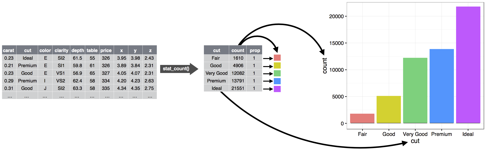

# Couches {#sec-layers}

```{r}
#| echo: false
source("_common.R")
```

## Introduction

Dans le @sec-data-visualization, vous avez appris à faire bien plus que de simples nuages de points, diagrammes en barres et boîtes à moustaches.
Vous avez assimilé les bases qui vous permettront de créer *n'importe quel* type de graphique avec ggplot2.

Dans ce chapitre, vous approfondirez ces bases en découvrant la grammaire en couches des graphiques.
Nous commencerons par une exploration plus détaillée des mappages esthétiques, des objets géométriques et des facettes.
Vous apprendrez ensuite les transformations statistiques que ggplot2 effectue en arrière-plan lors de la création d'un graphique.
Ces transformations servent à calculer de nouvelles valeurs à représenter, comme les hauteurs des barres dans un diagramme en barres ou les médianes dans une boîte à moustaches.
Vous découvrirez également les ajustements de position, qui modifient la façon dont les geoms sont affichés dans vos graphiques.
Enfin, nous introduirons brièvement les systèmes de coordonnées.

Nous ne présenterons pas chaque fonction et option pour chaque couche, mais nous vous guiderons à travers les fonctionnalités les plus importantes et les plus couramment utilisées fournies par ggplot2, et nous vous présenterons les packages qui étendent ggplot2.

### Prérequis

Ce chapitre se concentre sur ggplot2.
Pour accéder aux jeux de données, pages d'aide et fonctions utilisées dans ce chapitre, chargez le tidyverse en exécutant ce code :

```{r}
#| label: setup
#| message: false
library(tidyverse)
```

## Mappages esthétiques

> « La plus grande utilité d'une image, c'est quand elle nous force à remarquer ce que nous ne nous attendions pas à voir. » --- John Tukey

Souvenez-vous que le data frame `mpg` fourni avec le package ggplot2 contient `r nrow(mpg)` observations sur `r mpg |> distinct(model) |> nrow()` modèles de voitures.

```{r}
mpg
```

Parmi les variables dans `mpg`, on trouve :

1.  `displ` : la cylindrée du moteur d'une voiture, en litres.
    La variable est numérique.

2.  `hwy` : l'efficacité énergétique d'une voiture sur autoroute, en miles par gallon (mpg).
    Une voiture avec une faible efficacité énergétique consomme plus de carburant qu'une voiture avec une haute efficacité énergétique sur la même distance.
    La variable est numérique.

3.  `class` : type de voiture.
    La variable est catégorique.

Commençons par visualiser la relation entre `displ` et `hwy` pour différentes `class`es de voitures.
Nous pouvons faire cela avec un nuage de points où les variables numériques sont mappées aux esthétiques `x` et `y` et la variable catégorique est mappée à une esthétique comme `color` ou `shape`.

```{r}
#| layout-ncol: 2
#| fig-width: 4
#| fig-alt: |
#|   Deux nuages de points côte à côte, tous deux visualisant l'efficacité 
#|   énergétique sur autoroute par rapport à la cylindrée du moteur et 
#|   montrant une association négative. Dans le graphique de gauche, class 
#|   est mappée à l'esthétique color, donnant différentes couleurs pour chaque 
#|   classe. Dans le graphique de droite, class est mappée à l'esthétique shape, 
#|   donnant différentes formes de caractères de tracé pour chaque classe, 
#|   sauf pour suv. Chaque graphique est accompagné d'une légende qui montre 
#|   le mappage entre color ou shape et les niveaux de la variable class.
# Gauche
ggplot(mpg, aes(x = displ, y = hwy, color = class)) +
  geom_point()

# Droite
ggplot(mpg, aes(x = displ, y = hwy, shape = class)) +
  geom_point()
```

Quand `class` est mappée à `shape`, nous obtenons deux avertissements :

> 1: The shape palette can deal with a maximum of 6 discrete values because more than 6 becomes difficult to discriminate; you have 7.
> Consider specifying shapes manually if you must have them.
>
> 2: Removed 62 rows containing missing values (`geom_point()`).

Puisque ggplot2 n'utilise par défaut que six formes à la fois, les groupes supplémentaires ne seront pas tracés lorsque vous utiliserez l'esthétique shape.
Le second avertissement est connexe -- il y a 62 SUVs dans le jeu de données et ils ne sont pas tracés.

De la même façon, nous pouvons mapper `class` aux esthétiques `size` ou `alpha` aussi, qui contrôlent respectivement la taille et la transparence des points.

```{r}
#| layout-ncol: 2
#| fig-width: 4
#| fig-alt: |
#|   Deux nuages de points côte à côte, tous deux visualisant l'efficacité 
#|   énergétique sur autoroute par rapport à la cylindrée du moteur et 
#|   montrant une association négative. Dans le graphique de gauche, class 
#|   est mappée à l'esthétique size, donnant différentes tailles pour chaque 
#|   classe. Dans le graphique de droite, class est mappée à l'esthétique alpha, 
#|   donnant différents niveaux d'alpha (transparence) pour chaque classe. 
#|   Chaque graphique est accompagné d'une légende qui montre le mappage entre 
#|   size ou le niveau alpha et les niveaux de la variable class.
# Gauche
ggplot(mpg, aes(x = displ, y = hwy, size = class)) +
  geom_point()

# Droite
ggplot(mpg, aes(x = displ, y = hwy, alpha = class)) +
  geom_point()
```

Ces deux graphiques produisent aussi des avertissements :

> Using alpha for a discrete variable is not advised.

Mapper une variable discrète non ordonnée (catégorique) (`class`) à une esthétique ordonnée (`size` ou `alpha`) n'est généralement pas une bonne idée car cela implique un classement qui n'existe pas en réalité.

Une fois que vous mappez une esthétique, ggplot2 s'occupe du reste.
Il sélectionne une échelle raisonnable à utiliser avec l'esthétique et construit une légende qui explique le mappage entre les niveaux et les valeurs.
Pour les esthétiques x et y, ggplot2 ne crée pas de légende, mais crée une ligne d'axe avec des repères et une étiquette.
La ligne d'axe fournit les mêmes informations qu'une légende ; elle explique le mappage entre les positions et les valeurs.

Vous pouvez aussi définir manuellement les propriétés visuelles de votre geom en tant qu'argument de votre fonction geom (*en dehors* de `aes()`) plutôt que de vous fier au mappage d'une variable pour déterminer l'apparence.
Par exemple, nous pouvons faire que tous les points de notre graphique soient bleus :

```{r}
#| fig-alt: |
#|   Nuage de points de l'efficacité énergétique sur autoroute par rapport 
#|   à la cylindrée du moteur montrant une association négative. Tous les 
#|   points sont bleus.
ggplot(mpg, aes(x = displ, y = hwy)) + 
  geom_point(color = "blue")
```

Ici, la couleur ne transmet pas d'information sur une variable, mais change simplement l'apparence du graphique.
Vous devrez choisir une valeur qui a du sens pour cette esthétique :

-   Le nom d'une couleur sous forme de chaîne de caractères, par ex., `color = "blue"`
-   La taille d'un point en mm, par ex., `size = 1`
-   La forme d'un point sous forme de nombre, par ex., `shape = 1`, comme montré en @fig-shapes.

```{r}
#| label: fig-shapes
#| echo: false
#| warning: false
#| fig.asp: 0.364
#| fig-align: "center"
#| fig-cap: |
#|   R a 26 formes intégrées identifiées par des nombres. Il y a des doublons 
#|   apparents : par exemple, 0, 15 et 22 sont tous des carrés. La différence 
#|   vient de l'interaction des esthétiques `color` et `fill`. Les formes 
#|   creuses (0--14) ont une bordure déterminée par `color` ; les formes 
#|   pleines (15--20) sont remplies avec `color` ; les formes remplies 
#|   (21--25) ont une bordure de `color` et sont remplies avec `fill`. Les 
#|   formes sont arrangées pour garder des formes similaires côte à côte.
#| fig-alt: |
#|   Mappage entre les formes et les nombres qui les représentent : 0 - carré 
#|   ouvert, 1 - cercle ouvert, 2 - triangle ouvert, 3 - plus, 4 - croix, 
#|   5 - diamant ouvert, 6 - triangle vers le bas ouvert, 7 - carré croix, 
#|   8 - astérisque, 9 - diamant plus, 10 - cercle plus, 11 - étoile, 
#|   12 - carré plus, 13 - cercle croix, 14 - carré triangle, 15 - carré, 
#|   16 - petit cercle, 17 - triangle, 18 - diamant, 19 - cercle, 20 - point, 
#|   21 - cercle rempli, 22 - carré rempli, 23 - diamant rempli, 
#|   24 - triangle rempli, 25 - triangle vers le bas rempli.
shapes <- tibble(
  shape = c(0, 1, 2, 5, 3, 4, 6:19, 22, 21, 24, 23, 20, 25),
  x = (0:25 %/% 5) / 2,
  y = (-(0:25 %% 5)) / 4
)
ggplot(shapes, aes(x, y)) + 
  geom_point(aes(shape = shape), size = 5, fill = "red") +
  geom_text(aes(label = shape), hjust = 0, nudge_x = 0.15) +
  scale_shape_identity() +
  expand_limits(x = 4.1) +
  scale_x_continuous(NULL, breaks = NULL) + 
  scale_y_continuous(NULL, breaks = NULL, limits = c(-1.2, 0.2)) + 
  theme_minimal() +
  theme(aspect.ratio = 1/2.75)
```

Jusqu'à présent, nous avons discuté des esthétiques que nous pouvons mapper ou définir dans un nuage de points, lors de l'utilisation d'une geom point.
Vous pouvez en savoir plus sur tous les mappages esthétiques possibles dans la vignette de spécifications d'esthétiques à <https://ggplot2.tidyverse.org/articles/ggplot2-specs.html>.

Les esthétiques spécifiques que vous pouvez utiliser pour un graphique dépendent de la geom que vous utilisez pour représenter les données.
Dans la section suivante, nous approfondissons les geoms.

### Exercices

1.  Créez un nuage de points de `hwy` vs. `displ` où les points sont des triangles remplis de rose.

2.  Pourquoi le code suivant n'a-t-il pas produit un graphique avec des points bleus ?

    ```{r}
    #| fig-show: hide
    #| fig-alt: |
    #|   Nuage de points de l'efficacité énergétique sur autoroute par rapport 
    #|   à la cylindrée du moteur montrant une association négative. Tous les 
    #|   points sont rouges et la légende montre un point rouge mappé au mot bleu.
    ggplot(mpg) + 
      geom_point(aes(x = displ, y = hwy, color = "blue"))
    ```

3.  Que fait l'esthétique `stroke` ?
    Avec quelles formes est-elle compatible ?
    (Indice : utilisez `?geom_point`)

4.  Que se passe-t-il si vous mappez une esthétique à quelque chose d'autre qu'un nom de variable, comme `aes(color = displ < 5)` ?
    Notez que vous devrez aussi spécifier x et y.

## Objets géométriques {#sec-geometric-objects}

En quoi ces deux graphiques se ressemblent-ils ?

```{r}
#| echo: false
#| message: false
#| layout-ncol: 2
#| fig-width: 3
#| fig-alt: |
#|   Il y a deux graphiques. Le graphique de gauche est un nuage de points 
#|   de l'efficacité énergétique sur autoroute par rapport à la cylindrée 
#|   du moteur et le graphique de droite montre une courbe lisse qui suit 
#|   la trajectoire de la relation entre ces variables. Un intervalle de 
#|   confiance autour de la courbe lisse est également affiché.
ggplot(mpg, aes(x = displ, y = hwy)) + 
  geom_point()

ggplot(mpg, aes(x = displ, y = hwy)) + 
  geom_smooth()
```

Les deux graphiques contiennent la même variable x, la même variable y, et décrivent tous deux les mêmes données.
Mais les graphiques ne sont pas identiques.
Chaque graphique utilise un objet géométrique différent, une geom, pour représenter les données.
Le graphique de gauche utilise la géométrie point, et le graphique de droite utilise la géométrie smooth, une ligne lisse ajustée aux données.

Pour modifier la géométrie de votre graphique, changez la fonction geom que vous ajoutez à `ggplot()`.
Par exemple, pour créer les graphiques ci-dessus, vous pouvez utiliser le code suivant :

```{r}
#| fig-show: hide
# Gauche
ggplot(mpg, aes(x = displ, y = hwy)) + 
  geom_point()

# Droite
ggplot(mpg, aes(x = displ, y = hwy)) + 
  geom_smooth()
```

Chaque fonction geom dans ggplot2 prend un argument `mapping`, défini soit localement dans la couche geom soit globalement dans la couche `ggplot()`.
Cependant, chaque esthétique ne fonctionne pas avec chaque geom.
Vous pouvez définir la forme d'un point, mais vous ne pouvez pas définir la « forme » d'une ligne.
Si vous essayez, ggplot2 ignorera silencieusement ce mappage esthétique.
En revanche, vous *pourriez* définir le linetype d'une ligne.
`geom_smooth()` dessinera une ligne différente, avec un linetype différent, pour chaque valeur unique de la variable que vous mappez à linetype.

```{r}
#| message: false
#| layout-ncol: 2
#| fig-width: 3
#| fig-alt: |
#|   Deux graphiques de l'efficacité énergétique sur autoroute par rapport 
#|   à la cylindrée du moteur. Les données sont représentées avec des courbes 
#|   lisses. À gauche, trois courbes lisses, toutes avec le même linetype. 
#|   À droite, trois courbes lisses avec différents types de lignes (solide, 
#|   pointillé ou long pointillé) pour chaque type de chaîne de transmission. 
#|   Dans les deux graphiques, les intervalles de confiance autour des courbes 
#|   lisses sont également affichés.
# Gauche
ggplot(mpg, aes(x = displ, y = hwy, shape = drv)) + 
  geom_smooth()

# Droite
ggplot(mpg, aes(x = displ, y = hwy, linetype = drv)) + 
  geom_smooth()
```

Ici, `geom_smooth()` sépare les voitures en trois lignes selon leur valeur `drv`, qui décrit la chaîne de transmission d'une voiture.
Une ligne décrit tous les points qui ont une valeur `4`, une ligne décrit tous les points qui ont une valeur `f`, et une ligne décrit tous les points qui ont une valeur `r`.
Ici, `4` signifie quatre roues motrices, `f` signifie traction avant, et `r` signifie traction arrière.

Si cela semble étrange, nous pouvons clarifier en superposant les lignes sur les données brutes, puis en colorant tout selon `drv`.

```{r}
#| message: false
#| fig-alt: |
#|   Un graphique de l'efficacité énergétique sur autoroute par rapport à 
#|   la cylindrée du moteur. Les données sont représentées avec des points 
#|   (colorés par chaîne de transmission) ainsi que des courbes lisses 
#|   (où le type de ligne est déterminé selon la chaîne de transmission 
#|   aussi). Les intervalles de confiance autour des courbes lisses sont 
#|   également affichés.
ggplot(mpg, aes(x = displ, y = hwy, color = drv)) + 
  geom_point() +
  geom_smooth(aes(linetype = drv))
```

Notez que ce graphique contient deux geoms dans le même graphique.

De nombreuses geoms, comme `geom_smooth()`, utilisent un seul objet géométrique pour afficher plusieurs lignes de données.
Pour ces geoms, vous pouvez définir l'esthétique `group` à une variable catégorique pour dessiner plusieurs objets.
ggplot2 dessinera un objet séparé pour chaque valeur unique de la variable de groupement.
En pratique, ggplot2 regroupera automatiquement les données pour ces geoms chaque fois que vous mappez une esthétique à une variable discrète (comme dans l'exemple `linetype`).
C'est pratique de s'appuyer sur cette fonctionnalité car l'esthétique `group` en elle-même n'ajoute pas de légende ou de caractéristiques distinctives aux geoms.

```{r}
#| layout-ncol: 3
#| fig-width: 3
#| fig-asp: 1
#| message: false
#| fig-alt: |
#|   Trois graphiques, chacun avec l'efficacité énergétique sur autoroute 
#|   sur l'axe des y et la cylindrée du moteur sur l'axe des x, où les 
#|   données sont représentées par une courbe lisse. Le premier graphique 
#|   ne contient que ces deux variables, le graphique du centre a trois 
#|   courbes lisses séparées pour chaque niveau de chaîne de transmission, 
#|   et le graphique de droite a non seulement les mêmes trois courbes lisses 
#|   séparées pour chaque niveau de chaîne de transmission, mais ces courbes 
#|   sont tracées en différentes couleurs. Les intervalles de confiance autour 
#|   des courbes lisses sont également affichés.
# Gauche
ggplot(mpg, aes(x = displ, y = hwy)) +
  geom_smooth()

# Milieu
ggplot(mpg, aes(x = displ, y = hwy)) +
  geom_smooth(aes(group = drv))

# Droite
ggplot(mpg, aes(x = displ, y = hwy)) +
  geom_smooth(aes(color = drv), show.legend = FALSE)
```

Si vous placez des mappages dans une fonction geom, ggplot2 les traitera comme des mappages locaux pour la couche.
Il utilisera ces mappages pour étendre ou remplacer les mappages globaux *pour cette couche uniquement*.
Cela rend possible l'affichage d'esthétiques différentes dans différentes couches.

```{r}
#| message: false
#| fig-alt: |
#|   Nuage de points de l'efficacité énergétique sur autoroute par rapport 
#|   à la cylindrée du moteur, où les points sont colorés selon la classe 
#|   de la voiture. Une courbe lisse suivant la trajectoire de la relation 
#|   entre l'efficacité énergétique sur autoroute par rapport à la cylindrée 
#|   du moteur est superposée avec un intervalle de confiance autour.
ggplot(mpg, aes(x = displ, y = hwy)) + 
  geom_point(aes(color = class)) + 
  geom_smooth()
```

Vous pouvez utiliser la même idée pour spécifier différentes `data` pour chaque couche.
Ici, nous utilisons des points rouges ainsi que des cercles ouverts pour mettre en évidence les voitures à deux places.
L'argument de données local dans `geom_point()` remplace l'argument de données global dans `ggplot()` pour cette couche uniquement.

```{r}
#| message: false
#| fig-alt: |
#|   Nuage de points de l'efficacité énergétique sur autoroute par rapport 
#|   à la cylindrée du moteur, où les voitures à deux places sont mises en 
#|   évidence avec des points rouges et des cercles ouverts.
ggplot(mpg, aes(x = displ, y = hwy)) + 
  geom_point() + 
  geom_point(
    data = mpg |> filter(class == "2seater"), 
    color = "red"
  ) +
  geom_point(
    data = mpg |> filter(class == "2seater"), 
    shape = "circle open", size = 3, color = "red"
  )
```

Les geoms sont les éléments fondamentaux de ggplot2.
Vous pouvez complètement transformer l'apparence de votre graphique en changeant sa geom, et différentes geoms peuvent révéler différentes caractéristiques de vos données.
Par exemple, l'histogramme et le graphique de densité ci-dessous révèlent que la distribution du kilométrage sur autoroute est bimodale et asymétrique à droite, tandis que la boîte à moustaches révèle deux valeurs aberrantes potentielles.

```{r}
#| layout-ncol: 3
#| fig-width: 3
#| fig-alt: |
#|   Trois graphiques : histogramme, graphique de densité et boîte à moustaches 
#|   du kilométrage sur autoroute.
# Gauche
ggplot(mpg, aes(x = hwy)) +
  geom_histogram(binwidth = 2)

# Milieu
ggplot(mpg, aes(x = hwy)) +
  geom_density()

# Droite
ggplot(mpg, aes(x = hwy)) +
  geom_boxplot()
```

ggplot2 fournit plus de 40 geoms, mais elles ne couvrent pas tous les graphiques possibles.
Si vous avez besoin d'une geom différente, nous vous recommandons d'abord de vérifier les packages d'extension pour voir si quelqu'un d'autre l'a déjà implémentée (voir <https://exts.ggplot2.tidyverse.org/gallery/> pour un aperçu).
Par exemple, le package **ggridges** ([https://wilkelab.org/ggridges](https://wilkelab.org/ggridges/){.uri}) est utile pour faire des graphiques en arêtes de poisson, qui peuvent être utiles pour visualiser la densité d'une variable numérique pour différents niveaux d'une variable catégorique.
Dans le graphique suivant, non seulement nous avons utilisé une nouvelle geom (`geom_density_ridges()`), mais nous avons aussi mappé la même variable à plusieurs esthétiques (`drv` à `y`, `fill` et `color`) ainsi que défini une esthétique (`alpha = 0.5`) pour rendre les courbes de densité transparentes.

```{r}
#| fig-asp: 0.33
#| fig-alt: |
#|   Courbes de densité du kilométrage sur autoroute pour les voitures à 
#|   roues arrière, traction avant et traction intégrale tracées séparément. 
#|   La distribution est bimodale et à peu près symétrique pour les voitures 
#|   à traction arrière et intégrale, et unimodale et asymétrique à droite 
#|   pour les voitures à traction avant.
library(ggridges)

ggplot(mpg, aes(x = hwy, y = drv, fill = drv, color = drv)) +
  geom_density_ridges(alpha = 0.5, show.legend = FALSE)
```

Le meilleur endroit pour avoir un aperçu global de toutes les geoms que ggplot2 offre ainsi que de toutes les fonctions du package, est la page de référence : <https://ggplot2.tidyverse.org/reference>.
Pour en savoir plus sur une seule geom, utilisez l'aide (par ex., `?geom_smooth`).

### Exercices

1.  Quelle geom utiliseriez-vous pour dessiner un graphique linéaire ?
    Une boîte à moustaches ?
    Un histogramme ?
    Un graphique en aires ?

2.  Plus tôt dans ce chapitre nous avons utilisé `show.legend` sans l'expliquer :

    ```{r}
    #| fig-show: hide
    #| message: false
    ggplot(mpg, aes(x = displ, y = hwy)) +
      geom_smooth(aes(color = drv), show.legend = FALSE)
    ```

    Que fait `show.legend = FALSE` ici ?
    Que se passe-t-il si vous le supprimez ?
    Pourquoi pensez-vous que nous l'avons utilisé plus tôt ?

3.  Que fait l'argument `se` de `geom_smooth()` ?

4.  Recréez le code R nécessaire pour générer les graphiques suivants.
    Notez que partout où une variable catégorique est utilisée dans le graphique, c'est `drv`.

    ```{r}
    #| echo: false
    #| message: false
    #| layout-ncol: 2
    #| fig-width: 3
    #| fig-alt: |
    #|   Il y a six nuages de points dans cette figure, arrangés dans une grille 3x2. 
    #|   Dans tous les graphiques, l'efficacité énergétique sur autoroute des voitures 
    #|   est sur l'axe y et la cylindrée du moteur est sur l'axe x. Le premier graphique 
    #|   montre tous les points en noir avec une courbe lisse superposée. Dans le 
    #|   deuxième graphique, les points sont aussi tous noirs, avec des courbes lisses 
    #|   séparées superposées pour chaque niveau de chaîne de transmission. Sur le 
    #|   troisième graphique, les points et les courbes lisses sont représentés en 
    #|   différentes couleurs pour chaque niveau de chaîne de transmission. Dans le 
    #|   quatrième graphique, les points sont représentés en différentes couleurs pour 
    #|   chaque niveau de chaîne de transmission, mais il n'y a qu'une seule ligne lisse 
    #|   ajustée à l'ensemble des données. Dans le cinquième graphique, les points sont 
    #|   représentés en différentes couleurs pour chaque niveau de chaîne de transmission, 
    #|   et une courbe lisse séparée avec différents types de lignes est ajustée à 
    #|   chaque niveau de chaîne de transmission. Et enfin dans le sixième graphique, 
    #|   les points sont représentés en différentes couleurs pour chaque niveau de chaîne 
    #|   de transmission et ils ont une bordure blanche épaisse.
    ggplot(mpg, aes(x = displ, y = hwy)) + 
      geom_point() + 
      geom_smooth(se = FALSE)
    ggplot(mpg, aes(x = displ, y = hwy)) + 
      geom_smooth(aes(group = drv), se = FALSE) +
      geom_point()
    ggplot(mpg, aes(x = displ, y = hwy, color = drv)) + 
      geom_point() + 
      geom_smooth(se = FALSE)
    ggplot(mpg, aes(x = displ, y = hwy)) + 
      geom_point(aes(color = drv)) + 
      geom_smooth(se = FALSE)
    ggplot(mpg, aes(x = displ, y = hwy)) + 
      geom_point(aes(color = drv)) +
      geom_smooth(aes(linetype = drv), se = FALSE)
    ggplot(mpg, aes(x = displ, y = hwy)) + 
      geom_point(size = 4, color = "white") + 
      geom_point(aes(color = drv))
    ```

## Facettes

Dans le @sec-data-visualization vous avez appris à faire des facettes avec `facet_wrap()`, qui divise un graphique en sous-graphiques qui affichent chacun un sous-ensemble de données basé sur une variable catégorique.

```{r}
#| fig-alt: |
#|   Nuage de points de l'efficacité énergétique sur autoroute par rapport 
#|   à la cylindrée du moteur, facetté par nombre de cylindres, avec des 
#|   facettes s'étendant sur deux lignes.
ggplot(mpg, aes(x = displ, y = hwy)) + 
  geom_point() + 
  facet_wrap(~cyl)
```

Pour faire des facettes en combinant deux variables, passez de `facet_wrap()` à `facet_grid()`.
Le premier argument de `facet_grid()` est aussi une formule, mais maintenant c'est une formule bilatérale : `rows ~ cols`.

```{r}
#| fig-alt: |
#|   Nuage de points de l'efficacité énergétique sur autoroute par rapport 
#|   à la cylindrée du moteur, facetté par nombre de cylindres dans les lignes 
#|   et par type de chaîne de transmission dans les colonnes. Cela produit une 
#|   grille 4x3 de 12 facettes. Certaines de ces facettes n'ont aucune 
#|   observation : 5 cylindres et traction intégrale, 4 ou 5 cylindres et 
#|   traction avant.
ggplot(mpg, aes(x = displ, y = hwy)) + 
  geom_point() + 
  facet_grid(drv ~ cyl)
```

Par défaut, chacune des facettes partage la même échelle et plage pour les axes x et y.
C'est utile quand vous voulez comparer les données entre les facettes, mais cela peut être limitant quand vous voulez mieux visualiser la relation au sein de chaque facette.
Définir l'argument `scales` dans une fonction de facettage à `"free_x"` permettra différentes échelles de l'axe x dans les colonnes, `"free_y"` permettra différentes échelles de l'axe y dans les lignes, et `"free"` permettra les deux.

```{r}
#| fig-alt: |
#|   Nuage de points de l'efficacité énergétique sur autoroute par rapport 
#|   à la cylindrée du moteur, facetté par nombre de cylindres dans les lignes 
#|   et par type de chaîne de transmission dans les colonnes. Cela produit une 
#|   grille 4x3 de 12 facettes. Certaines de ces facettes n'ont aucune 
#|   observation : 5 cylindres et traction intégrale, 4 ou 5 cylindres et 
#|   traction avant. Les facettes au sein d'une ligne partagent la même échelle 
#|   y et les facettes au sein d'une colonne partagent la même échelle x.
ggplot(mpg, aes(x = displ, y = hwy)) + 
  geom_point() + 
  facet_grid(drv ~ cyl, scales = "free")
```

### Exercices

1.  Que se passe-t-il si vous facettez sur une variable continue ?

2.  Que signifient les cellules vides dans le graphique ci-dessus avec `facet_grid(drv ~ cyl)` ?
    Exécutez le code suivant.
    Comment se rapportent-elles au graphique résultant ?

    ```{r}
    #| fig-show: hide
    ggplot(mpg) + 
      geom_point(aes(x = drv, y = cyl))
    ```

3.  Quels graphiques le code suivant crée-t-il ?
    Que fait `.` ?

    ```{r}
    #| fig-show: hide
    ggplot(mpg) + 
      geom_point(aes(x = displ, y = hwy)) +
      facet_grid(drv ~ .)

    ggplot(mpg) + 
      geom_point(aes(x = displ, y = hwy)) +
      facet_grid(. ~ cyl)
    ```

4.  Prenez le premier graphique facetté de cette section :

    ```{r}
    #| fig-show: hide
    ggplot(mpg) + 
      geom_point(aes(x = displ, y = hwy)) + 
      facet_wrap(~ cyl, nrow = 2)
    ```

    Quels sont les avantages d'utiliser les facettes plutôt que l'esthétique color ?
    Quels sont les inconvénients ?
    Comment cet équilibre pourrait-il changer si vous aviez un jeu de données plus grand ?

5.  Lisez `?facet_wrap`.
    Que fait `nrow` ?
    Que fait `ncol` ?
    Quelles autres options contrôlent la disposition des panneaux individuels ?
    Pourquoi `facet_grid()` n'a-t-il pas d'arguments `nrow` et `ncol` ?

6.  Lequel des graphiques suivants facilite la comparaison de la cylindrée du moteur (`displ`) entre les voitures avec différentes chaînes de transmission ?
    Quel est le bon moment pour placer une variable de facettage dans les lignes ou les colonnes ?

    ```{r}
    #| fig-show: hide
    #| message: false
    ggplot(mpg, aes(x = displ)) + 
      geom_histogram() + 
      facet_grid(drv ~ .)

    ggplot(mpg, aes(x = displ)) + 
      geom_histogram() +
      facet_grid(. ~ drv)
    ```

7.  Recréez le graphique suivant en utilisant `facet_wrap()` à la place de `facet_grid()`.
    Comment les positions des étiquettes de facette changent-elles ?

    ```{r}
    #| fig-show: hide
    ggplot(mpg) + 
      geom_point(aes(x = displ, y = hwy)) +
      facet_grid(drv ~ .)
    ```

## Transformations statistiques

Considérez un graphique en barres, créé avec `geom_bar()` ou `geom_col()`.
Le graphique suivant affiche le nombre total de diamants dans le jeu de données `diamonds`, groupés par `cut` (taillage).
Le jeu de données `diamonds` est dans le package ggplot2 et contient des informations sur \~54 000 diamants, incluant le `price`, `carat`, `color`, `clarity` et `cut` de chaque diamant.
Le graphique montre que plus de diamants sont disponibles avec des tailles de haute qualité qu'avec des tailles de basse qualité.

```{r}
#| fig-alt: |
#|   Graphique en barres du nombre de chaque taille de diamant. Il y a 
#|   environ 1500 diamants Fair, 5000 Good, 12000 Very Good, 14000 Premium 
#|   et 22000 Ideal.
ggplot(diamonds, aes(x = cut)) + 
  geom_bar()
```

Sur l'axe x, le graphique affiche `cut`, une variable de `diamonds`.
Sur l'axe y, il affiche count, mais count n'est pas une variable de `diamonds` !
D'où vient count ?
De nombreux graphiques, comme les nuages de points, tracent les valeurs brutes de votre jeu de données.
D'autres graphiques, comme les diagrammes en barres, calculent de nouvelles valeurs à tracer :

-   Les diagrammes en barres, histogrammes et polygones de fréquence regroupent vos données, puis tracent les dénombrements des classes, le nombre de points qui se situent dans chaque classe.

-   Les lisseurs (`geom_smooth`) ajustent un modèle à vos données, puis tracent les prédictions du modèle.

-   Les boîtes à moustaches calculent le résumé à cinq chiffres de la distribution, puis affichent ce résumé dans une boîte spécialement formatée.

L'algorithme utilisé pour calculer de nouvelles valeurs pour un graphique s'appelle un **stat**, abréviation de transformation statistique.
La @fig-vis-stat-bar montre comment ce processus fonctionne avec `geom_bar()`.

```{r}
#| label: fig-vis-stat-bar
#| echo: false
#| out-width: "100%"
#| fig-cap: |
#|   Lors de la création d'un graphique en barres, nous commençons d'abord 
#|   par les données brutes, puis nous les agrégeons pour compter le nombre 
#|   d'observations dans chaque barre, et enfin nous mappons ces variables 
#|   calculées aux esthétiques du graphique.
#| fig-alt: |
#|   Une figure démontrant trois étapes de création d'un graphique en barres. 
#|   Étape 1. geom_bar() commence avec le jeu de données diamonds. Étape 2. 
#|   geom_bar() transforme les données avec le stat count, qui retourne un 
#|   jeu de données de valeurs cut et de dénombrements. Étape 3. geom_bar() 
#|   utilise les données transformées pour construire le graphique. cut est 
#|   mappé à l'axe x, count est mappé à l'axe y.
knitr::include_graphics("images/visualization-stat-bar.png")
```

Vous pouvez apprendre quel stat une geom utilise en inspectant la valeur par défaut de l'argument `stat`.
Par exemple, `?geom_bar` montre que la valeur par défaut pour `stat` est "count", ce qui signifie que `geom_bar()` utilise `stat_count()`.
`stat_count()` est documenté sur la même page que `geom_bar()`.
Si vous faites défiler vers le bas, la section appelée « Computed variables » explique qu'elle calcule deux nouvelles variables : `count` et `prop`.

Chaque geom a un stat par défaut ; et chaque stat a une geom par défaut.
Cela signifie que vous pouvez généralement utiliser les geoms sans vous soucier de la transformation statistique sous-jacente.
Cependant, il y a trois raisons pour lesquelles vous pourriez avoir besoin de spécifier un stat explicitement :

1.  Si vous voulez remplacer le stat par défaut.
    Dans le code ci-dessous, nous modifions le stat de `geom_bar()` de count (par défaut) à identity.
    Cela nous permet de mapper la hauteur des barres aux valeurs brutes d'une variable y.

    ```{r}
    #| warning: false
    #| fig-alt: |
    #|   Graphique en barres du nombre de chaque taille de diamant. Il y a 
    #|   environ 1500 diamants Fair, 5000 Good, 12000 Very Good, 14000 Premium 
    #|   et 22000 Ideal.
    diamonds |>
      count(cut) |>
      ggplot(aes(x = cut, y = n)) +
      geom_bar(stat = "identity")
    ```

2.  Si vous voulez remplacer le mappage par défaut des variables transformées aux esthétiques.
    Par exemple, vous pourriez vouloir afficher un graphique en barres de proportions, plutôt que de dénombrements :

    ```{r}
    #| fig-alt: |
    #|   Graphique en barres de la proportion de chaque taille de diamant. 
    #|   Grossièrement, les diamants Fair représentent 0,03, Good 0,09, 
    #|   Very Good 0,22, Premium 0,26 et Ideal 0,40.
    ggplot(diamonds, aes(x = cut, y = after_stat(prop), group = 1)) + 
      geom_bar()
    ```

    Pour trouver les variables possibles qui peuvent être calculées par le stat, cherchez la section intitulée « computed variables » dans l'aide pour `geom_bar()`.

3.  Si vous voulez attirer davantage l'attention sur la transformation statistique dans votre code.
    Par exemple, vous pourriez utiliser `stat_summary()`, qui résume les valeurs y pour chaque valeur x unique, pour attirer l'attention sur le résumé que vous calculez :

    ```{r}
    #| fig-alt: |
    #|   Un graphique avec la profondeur sur l'axe y et la taille sur l'axe x 
    #|   (avec les niveaux fair, good, very good, premium et ideal) des diamants. 
    #|   Pour chaque niveau de taille, des lignes verticales s'étendent du minimum 
    #|   au maximum de profondeur pour les diamants dans cette catégorie de taille, 
    #|   et la profondeur médiane est indiquée sur la ligne avec un point.
    ggplot(diamonds) + 
      stat_summary(
        aes(x = cut, y = depth),
        fun.min = min,
        fun.max = max,
        fun = median
      )
    ```

ggplot2 fournit plus de 20 stats à votre disposition.
Chaque stat est une fonction, donc vous pouvez obtenir de l'aide de la manière habituelle, par ex., `?stat_bin`.

### Exercices

1.  Quelle est la geom par défaut associée à `stat_summary()` ?
    Comment pourriez-vous réécrire le graphique précédent pour utiliser cette fonction geom à la place de la fonction stat ?

2.  Que fait `geom_col()` ?
    Quelle est la différence avec `geom_bar()` ?

3.  La plupart des geoms et stats viennent par paires qui sont presque toujours utilisées ensemble.
    Faites une liste de toutes les paires.
    Qu'ont-elles en commun ?
    (Indice : parcourez la documentation.)

4.  Quelles variables `stat_smooth()` calcule-t-elle ?
    Quels arguments contrôlent son comportement ?

5.  Dans notre graphique en barres de proportions, nous avions besoin de définir `group = 1`.
    Pourquoi ?
    En d'autres termes, quel est le problème avec ces deux graphiques ?

    ```{r}
    #| fig-show: hide
    ggplot(diamonds, aes(x = cut, y = after_stat(prop))) + 
      geom_bar()
    ggplot(diamonds, aes(x = cut, fill = color, y = after_stat(prop))) + 
      geom_bar()
    ```

## Ajustements de position

Il y a un dernier tour de magie associé aux diagrammes en barres.
Vous pouvez colorer un graphique en barres en utilisant soit l'esthétique `color`, soit, de manière plus utile, l'esthétique `fill` :

```{r}
#| layout-ncol: 2
#| fig-width: 4
#| fig-alt: |
#|   Deux graphiques en barres des types de chaîne de transmission de voitures. 
#|   Dans le premier graphique, les barres ont des bordures colorées. Dans le 
#|   deuxième graphique, elles sont remplies de couleurs. Les hauteurs des 
#|   barres correspondent au nombre de voitures dans chaque catégorie drv.
# Gauche
ggplot(mpg, aes(x = drv, color = drv)) + 
  geom_bar()

# Droite
ggplot(mpg, aes(x = drv, fill = drv)) + 
  geom_bar()
```

Notez ce qui se passe si vous mappez l'esthétique fill à une autre variable, comme `class` : les barres sont automatiquement empilées.
Chaque rectangle coloré représente une combinaison de `drv` et `class`.

```{r}
#| fig-alt: |
#|   Graphique en barres segmenté des types de chaîne de transmission de voitures, 
#|   où chaque barre est remplie avec des couleurs pour les classes de voitures. 
#|   Les hauteurs des barres correspondent au nombre de voitures dans chaque 
#|   catégorie de chaîne de transmission, et les hauteurs des segments colorés 
#|   représentent le nombre de voitures avec un niveau de classe donné au sein 
#|   d'un niveau de chaîne de transmission donné.
ggplot(mpg, aes(x = drv, fill = class)) + 
  geom_bar()
```

L'empilement est effectué automatiquement en utilisant l'**ajustement de position** spécifié par l'argument `position`.
Si vous ne voulez pas un graphique en barres empilé, vous pouvez utiliser l'une des trois autres options : `"identity"`, `"dodge"` ou `"fill"`.

-   `position = "identity"` placera chaque objet exactement où il se situe dans le contexte du graphique.
    Ce n'est pas très utile pour les barres, car cela les chevauche.
    Pour voir ce chevauchement, nous devons soit rendre les barres légèrement transparentes en définissant `alpha` à une petite valeur, soit complètement transparentes en définissant `fill = NA`.

    ```{r}
    #| layout-ncol: 2
    #| fig-width: 4
    #| fig-alt: |
    #|   Graphique en barres segmenté des types de chaîne de transmission de voitures, 
    #|   où chaque barre est remplie avec des couleurs pour les classes de voitures. 
    #|   Les hauteurs des segments colorés représentent le nombre de voitures 
    #|   avec un niveau de classe donné au sein d'un niveau de chaîne de transmission 
    #|   donné. Cependant, les segments se chevauchent. Dans le premier graphique, 
    #|   les barres sont remplies avec des couleurs transparentes et dans le 
    #|   deuxième graphique, elles ne sont que décrites avec la couleur.
    # Gauche
    ggplot(mpg, aes(x = drv, fill = class)) + 
      geom_bar(alpha = 1/5, position = "identity")

    # Droite
    ggplot(mpg, aes(x = drv, color = class)) + 
      geom_bar(fill = NA, position = "identity")
    ```

    L'ajustement de la position identity est plus utile pour les geoms en 2D, comme les points pour lesquels c'est la valeur par défaut.

-   `position = "fill"` fonctionne comme l'empilement, mais fait que chaque ensemble de barres empilées a la même hauteur.
    Cela facilite la comparaison des proportions entre les groupes.

-   `position = "dodge"` place les objets qui se chevauchent directement *à côté* l'un de l'autre.
    Cela facilite la comparaison des valeurs individuelles.

    ```{r}
    #| layout-ncol: 2
    #| fig-width: 4
    #| fig-alt: |
    #|   À gauche, graphique en barres segmenté des types de chaîne de transmission 
    #|   de voitures, où chaque barre est remplie avec des couleurs pour les niveaux 
    #|   de classe. La hauteur de chaque barre est 1 et les hauteurs des segments 
    #|   colorés représentent les proportions de voitures avec un niveau de classe 
    #|   donné au sein d'un niveau de chaîne de transmission donné. À droite, 
    #|   graphique en barres décalées des types de chaîne de transmission de voitures. 
    #|   Les barres décalées sont groupées par niveaux de chaîne de transmission. 
    #|   Au sein de chaque groupe, les barres représentent chaque niveau de classe. 
    #|   Certaines classes sont représentées au sein de certaines chaînes de transmission 
    #|   et non représentées dans d'autres, ce qui entraîne un nombre inégal de barres 
    #|   au sein de chaque groupe. Les hauteurs de ces barres représentent le nombre 
    #|   de voitures avec un niveau de chaîne de transmission et de classe donné.
    # Gauche
    ggplot(mpg, aes(x = drv, fill = class)) + 
      geom_bar(position = "fill")

    # Droite
    ggplot(mpg, aes(x = drv, fill = class)) + 
      geom_bar(position = "dodge")
    ```

Il y a un autre type d'ajustement qui n'est pas utile pour les diagrammes en barres, mais qui peut être très utile pour les nuages de points.
Souvenez-vous de notre premier nuage de points.
Avez-vous remarqué que le graphique affiche seulement 126 points alors qu'il y a 234 observations dans le jeu de données ?

```{r}
#| echo: false
#| fig-alt: |
#|   Nuage de points de l'efficacité énergétique sur autoroute par rapport 
#|   à la cylindrée du moteur montrant une association négative.
ggplot(mpg, aes(x = displ, y = hwy)) + 
  geom_point()
```

Les valeurs sous-jacentes de `hwy` et `displ` sont arrondies de sorte que les points apparaissent sur une grille, et de nombreux points se chevauchent.
Ce problème est connu sous le nom de **superposition** (overplotting).
Cet arrangement rend difficile la visualisation de la distribution des données.
Les points de données sont-ils répartis également dans tout le graphique, ou existe-t-il une combinaison spéciale de `hwy` et `displ` qui contient 109 valeurs ?

Vous pouvez éviter ce chevauchement en définissant l'ajustement de position sur « jitter ».
`position = "jitter"` ajoute du bruit aléatoire à chaque point.
Cela permet de répartir les points, car il est peu probable que deux points reçoivent la même quantité de bruit aléatoire.

```{r}
#| fig-alt: |
#|   Nuage de points décalé de l'efficacité énergétique sur autoroute par 
#|   rapport à la cylindrée du moteur. Le graphique montre une association négative.
ggplot(mpg, aes(x = displ, y = hwy)) + 
  geom_point(position = "jitter")
```

Ajouter du caractère aléatoire semble être une façon étrange d'améliorer votre graphique, mais bien qu'il le rende moins précis à petites échelles, il le rend *plus* révélateur à grandes échelles.
Puisque c'est si utile, ggplot2 dispose d'un raccourci pour `geom_point(position = "jitter")` : `geom_jitter()`.

Pour en savoir plus sur un ajustement de position, consultez la page d'aide associée à chaque ajustement : `?position_dodge`, `?position_fill`, `?position_identity`, `?position_jitter` et `?position_stack`.

### Exercices

1.  Quel est le problème avec le graphique suivant ?
    Comment pourriez-vous l'améliorer ?

    ```{r}
    #| fig-show: hide
    ggplot(mpg, aes(x = cty, y = hwy)) + 
      geom_point()
    ```

2.  Quelle est, le cas échéant, la différence entre les deux graphiques ?
    Pourquoi ?

    ```{r}
    #| fig-show: hide
    ggplot(mpg, aes(x = displ, y = hwy)) +
      geom_point()
    ggplot(mpg, aes(x = displ, y = hwy)) +
      geom_point(position = "identity")
    ```

3.  Quels paramètres de `geom_jitter()` contrôlent la quantité de décalage ?

4.  Comparez et contrastez `geom_jitter()` avec `geom_count()`.

5.  Quel est l'ajustement de position par défaut pour `geom_boxplot()` ?
    Créez une visualisation du jeu de données `mpg` qui le démontre.

## Systèmes de coordonnées

Les systèmes de coordonnées sont probablement la partie la plus compliquée de ggplot2.
Le système de coordonnées par défaut est le système de coordonnées cartésien où les positions x et y agissent indépendamment pour déterminer la localisation de chaque point.
Il y a deux autres systèmes de coordonnées qui sont parfois utiles.

-   `coord_quickmap()` permet de définir correctement le format d'image des cartes géographiques.
    C'est très important si vous tracez des données spatiales avec ggplot2.
    Nous n'avons pas la place d'aborder le sujet des cartes dans ce livre, mais vous pouvez en savoir plus dans le [chapitre Cartes](https://ggplot2-book.org/maps.html) de *ggplot2: Elegant graphics for data analysis*.

    ```{r}
    #| layout-ncol: 2
    #| fig-width: 3
    #| message: false
    #| fig-alt: |
    #|   Deux cartes des frontières de la Nouvelle-Zélande. Dans le premier 
    #|   graphique, le rapport d'aspect est incorrect, dans le deuxième graphique, 
    #|   il est correct.
    nz <- map_data("nz")

    ggplot(nz, aes(x = long, y = lat, group = group)) +
      geom_polygon(fill = "white", color = "black")

    ggplot(nz, aes(x = long, y = lat, group = group)) +
      geom_polygon(fill = "white", color = "black") +
      coord_quickmap()
    ```

-   `coord_polar()` utilise les coordonnées polaires.
    Les coordonnées polaires révèlent une connexion intéressante entre un graphique en barres et un graphique de Coxcomb.

    ```{r}
    #| layout-ncol: 2
    #| fig-width: 3
    #| fig-asp: 1
    #| fig-alt: |
    #|   Il y a deux graphiques. À gauche se trouve un graphique en barres de la 
    #|   clarté des diamants, à droite se trouve un graphique de Coxcomb des mêmes données.
    bar <- ggplot(data = diamonds) + 
      geom_bar(
        mapping = aes(x = clarity, fill = clarity), 
        show.legend = FALSE,
        width = 1
      ) + 
      theme(aspect.ratio = 1)

    bar + coord_flip()
    bar + coord_polar()
    ```

### Exercices

1.  Transformez un graphique en barres empilé en un diagramme circulaire en utilisant `coord_polar()`.

2.  Quelle est la différence entre `coord_quickmap()` et `coord_map()` ?

3.  Que vous dit le graphique suivant sur la relation entre les miles par gallon en ville et sur autoroute ?
    Pourquoi `coord_fixed()` est-il important ?
    Que fait `geom_abline()` ?

    ```{r}
    #| fig-show: hide
    ggplot(data = mpg, mapping = aes(x = cty, y = hwy)) +
      geom_point() + 
      geom_abline() +
      coord_fixed()
    ```

## La grammaire en couches des graphiques

Nous pouvons approfondir le modèle de représentation graphique que vous avez appris dans la @sec-ggplot2-calls en ajoutant des ajustements de position, des stats, des systèmes de coordonnées et des facettes :

```         
ggplot(data = <DATA>) + 
  <GEOM_FUNCTION>(
     mapping = aes(<MAPPINGS>),
     stat = <STAT>, 
     position = <POSITION>
  ) +
  <COORDINATE_FUNCTION> +
  <FACET_FUNCTION>
```

Notre nouveau modèle prend sept paramètres ; les mots entre `<>` qui apparaissent dans le modèle.
En pratique, vous devez rarement fournir les sept paramètres pour créer un graphique car ggplot2 fournira des valeurs par défaut, sauf pour les données, les mappages et la fonction geom.

Les sept paramètres du modèle composent la grammaire des graphiques, un système formel pour construire des graphiques.
La grammaire des graphiques est basée sur l'idée que vous pouvez décrire de façon unique *n'importe quel* graphique comme une combinaison d'un jeu de données, d'une géometrie, d'un ensemble de mappages, d'un stat, d'un ajustement de position, d'un système de coordonnées, d'un schéma de facettage et d'un thème.

Pour voir comment cela fonctionne, pensez à comment vous pourriez construire un graphique basique à partir de zéro : vous pourriez commencer par un jeu de données, puis le transformer en information que vous voulez afficher (avec un stat).
Ensuite, vous pourriez choisir un objet géométrique pour représenter chaque observation dans les données transformées.
Vous pourriez ensuite utiliser les propriétés esthétiques des geoms pour représenter les variables dans les données.
Vous mapperiez les valeurs de chaque variable aux niveaux d'une esthétique.
Ces étapes sont illustrées en @fig-visualization-grammar.
Vous sélectionneriez ensuite un système de coordonnées pour placer les geoms, en utilisant la localisation des objets (qui est elle-même une propriété esthétique) pour afficher les valeurs des variables x et y.

```{r}
#| label: fig-visualization-grammar
#| echo: false
#| fig-alt: |
#|   Une figure démontrant les étapes pour passer des données brutes à un tableau 
#|   de fréquences où chaque ligne représente un niveau de taille et une colonne 
#|   de dénombrement montre combien de diamants sont à ce niveau de taille. 
#|   Ensuite, ces valeurs sont mappées aux hauteurs des barres.
#| fig-cap: |
#|   Étapes pour passer des données brutes à un tableau de fréquences puis à un 
#|   graphique en barres où les hauteurs des barres représentent les fréquences.

```

À ce stade, vous auriez un graphique complet, mais vous pourriez ensuite ajuster les positions des geoms au sein du système de coordonnées (un ajustement de position) ou diviser le graphique en sous-graphiques (facettage).
Vous pourriez aussi étendre le graphique en ajoutant une ou plusieurs couches supplémentaires, où chaque couche supplémentaire utilise un jeu de données, une geom, un ensemble de mappages, un stat et un ajustement de position.

Vous pourriez utiliser cette méthode pour construire *n'importe quel* graphique.
En d'autres termes, vous pouvez utiliser le modèle de code que vous avez appris dans ce chapitre pour construire des centaines de milliers de graphiques uniques.

Si vous voulez en savoir plus sur les fondations théoriques de ggplot2, vous apprécierez peut-être la lecture de « [The Layered Grammar of Graphics](https://vita.had.co.nz/papers/layered-grammar.pdf) », un article scientifique qui décrit la théorie de ggplot2 en détail.

## Résumé

Dans ce chapitre, vous avez appris la grammaire en couches des graphiques en commençant par les esthétiques et les géométries pour construire un graphique simple, les facettes pour diviser le graphique en sous-ensembles, les statistiques pour comprendre comment les geoms sont calculées, les ajustements de position pour contrôler les détails précis de position quand les geoms pourraient se chevaucher, et les systèmes de coordonnées qui vous permettent de modifier fondamentalement ce que `x` et `y` signifient.
Il reste un aspect que nous n'avons pas encore abordé : le thème, que nous présenterons dans la @sec-themes.

Deux ressources très utiles pour avoir un aperçu des fonctionnalités complètes de ggplot2 sont l'aide-mémoire ggplot2 (que vous pouvez trouver à <https://posit.co/resources/cheatsheets>) et le site web du package ggplot2 ([https://ggplot2.tidyverse.org](https://ggplot2.tidyverse.org/)).

Une leçon importante à retenir de ce chapitre est que quand vous avez besoin d'une geom qui n'est pas fournie par ggplot2, c'est toujours bien de vérifier si quelqu'un d'autre a déjà résolu votre problème en créant un package d'extension ggplot2 qui offre cette geom.
