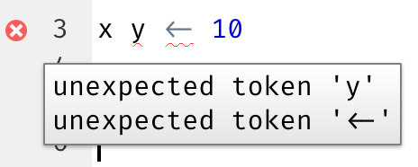
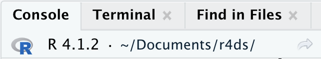

# Flux de travail : scripts et projets {#sec-workflow-scripts-projects}

```{r}
#| echo: false
source("_common.R")
```

Ce chapitre vous présentera deux outils essentiels pour organiser votre code : les scripts et les projets.

## Scripts

Jusqu'à présent, vous avez utilisé la console pour exécuter du code.
C'est un excellent point de départ, mais vous verrez rapidement que vous manquez de place dès que vous créez des graphiques ggplot2 plus complexes et de longues pipelines dplyr.
Utilisez l'éditeur de scripts pour avoir plus d'espace pour travailler.
Ouvrez-le en cliquant sur le menu File, en sélectionnant New File, puis R script, ou en utilisant le raccourci clavier Cmd/Ctrl + Maj + N.
Vous verrez maintenant quatre volets, comme dans la @fig-rstudio-script.
L'éditeur de scripts est un excellent endroit pour expérimenter votre code.
Quand vous voulez apporter une modification, vous n'avez pas besoin de retaper tout le code ; vous pouvez simplement éditer le script et le relancer.
Et une fois que vous avez écrit du code qui fonctionne et fait ce que vous voulez, vous pouvez le sauvegarder comme un fichier pour y revenir facilement plus tard.

```{r}
#| label: fig-rstudio-script
#| echo: false
#| out-width: ~
#| fig-cap: |
#|   L'ouverture de l'éditeur de scripts ajoute un nouveau volet en haut à gauche de
#|   l'IDE.
#| fig-alt: |
#|   IDE RStudio avec l'Éditeur, la Console et la Sortie en évidence.
knitr::include_graphics("diagrams/rstudio/script.png", dpi = 270)
```

### Exécuter du code

L'éditeur de scripts est un excellent endroit pour construire des graphiques ggplot2 complexes ou de longues séquences de manipulations dplyr.
La clé pour utiliser efficacement l'éditeur de scripts est de mémoriser l'un des raccourcis clavier les plus importants : Cmd/Ctrl + Entrée.
Cela exécute l'expression R actuelle dans la console.
Par exemple, considérez le code ci-dessous.

```{r}
#| eval: false
library(dplyr)
library(nycflights13)

not_cancelled <- flights |> 
  filter(!is.na(dep_delay)█, !is.na(arr_delay))

not_cancelled |> 
  group_by(year, month, day) |> 
  summarize(mean = mean(dep_delay))
```

Si votre curseur est à █, Cmd/Ctrl + Entrée exécutera la commande complète qui génère `not_cancelled`.
Cela déplacera également le curseur vers l'instruction suivante (commençant par `not_cancelled |>`).
Cela permet de parcourir facilement votre script en appuyant à plusieurs reprises sur Cmd/Ctrl + Entrée.

Au lieu d'exécuter votre code expression par expression, vous pouvez aussi exécuter le script complet en une seule étape avec Cmd/Ctrl + Maj + S.
Le faire régulièrement est un excellent moyen de s'assurer que vous avez intégré tous les éléments importants de votre code dans le script.

Nous vous recommandons de toujours commencer votre script par les packages dont vous avez besoin.
De cette façon, si vous partagez votre code avec d'autres, ils peuvent facilement voir quels packages ils doivent installer.
Notez cependant que vous ne devez jamais inclure `install.packages()` dans un script que vous partagez.
C'est malhonnête d'envoyer un script susceptible de modifier quelque chose sur l'ordinateur de quelqu'un d'autre s'il ne fait pas attention !

En étudiant les chapitres futurs, nous vous recommandons vivement de pratiquer dans l'éditeur de scripts et d'utiliser les raccourcis clavier.
Avec le temps, l'envoi de code à la console de cette façon deviendra si naturel que vous n'y penserez même pas.

### Diagnostiques de RStudio

Dans l'éditeur de scripts, RStudio met en évidence les erreurs de syntaxe avec une ligne pointillée rouge et une croix dans la barre latérale :

```{r}
#| echo: false
#| out-width: ~
#| fig-alt: |
#|   Éditeur de scripts avec le script x y <- 10. Une croix rouge indique qu'il y a 
#|   une erreur de syntaxe. L'erreur de syntaxe est aussi mise en évidence avec une 
#|   ligne pointillée rouge.
knitr::include_graphics("screenshots/rstudio-diagnostic.png")
```

Survolez la croix pour voir quel est le problème :

```{r}
#| echo: false
#| out-width: ~
#| fig-alt: |
#|   Éditeur de scripts avec le script x y <- 10. Une croix rouge indique qu'il y a 
#|   une erreur de syntaxe. L'erreur de syntaxe est aussi mise en évidence avec une 
#|   ligne pointillée rouge. Survoler la croix affiche une boîte de texte avec le texte 
#|   unexpected token y et unexpected token <-.

```

RStudio vous alertera aussi sur les problèmes potentiels :

```{r}
#| echo: false
#| out-width: ~
#| fig-alt: |
#|   Éditeur de scripts avec le script 3 == NA. Un point d'exclamation jaune 
#|   indique qu'il y a peut-être un problème. Survoler le point d'exclamation affiche 
#|   une boîte de texte avec le texte use is.na to check whether expression 
#|   evaluates to NA.
knitr::include_graphics("screenshots/rstudio-diagnostic-warn.png")
```

### Sauvegarde et nommage

RStudio enregistre automatiquement le contenu de l'éditeur de scripts quand vous quittez, et le recharge automatiquement quand vous le rouvrez.
Néanmoins, c'est mieux d'éviter Untitled1, Untitled2, Untitled3, etc. et de sauvegarder vos scripts avec des noms explicites.

Il peut être tentant de nommer vos fichiers `code.R` ou `monscript.R`, mais vous devriez réfléchir un peu plus avant de choisir un nom pour votre fichier.
Les trois principes importants pour le nommage des fichiers sont les suivants :

1.  Les noms de fichiers doivent être **lisibles par une machine** : évitez les espaces, les symboles et les caractères spéciaux. Ne comptez pas sur la distinction entre majuscules et minuscules pour distinguer les fichiers.
2.  Les noms de fichiers doivent être **lisibles par un humain** : utilisez les noms de fichiers pour décrire ce qui est dans le fichier.
3.  Les noms de fichiers doivent bien fonctionner avec le tri par défaut : commencez les noms de fichiers par des chiffres pour que le tri alphabétique les mette dans l'ordre dans lequel ils sont utilisés.

Par exemple, supposons que vous ayez les fichiers suivants dans un dossier de projet.

```         
alternative model.R
code for exploratory analysis.r
finalreport.qmd
FinalReport.qmd
fig 1.png
Figure_02.png
model_first_try.R
run-first.r
temp.txt
```

Il y a ici une variété de problèmes : il est difficile de trouver quel fichier exécuter en premier, les noms de fichiers contiennent des espaces, il y a deux fichiers portant le même nom mais avec une capitalisation différente (`finalreport` vs. `FinalReport`[^workflow-scripts-1]), et certains noms ne décrivent pas leur contenu (`run-first` et `temp`).

[^workflow-scripts-1]: Sans parler du fait que vous jouez avec le feu en utilisant « final » dans le nom 😆 La bande dessinée Piled Higher and Deeper a une [vignette amusante à ce sujet](https://phdcomics.com/comics/archive.php?comicid=1531).

Voici une meilleure façon de nommer et d'organiser le même ensemble de fichiers :

```         
01-load-data.R
02-exploratory-analysis.R
03-model-approach-1.R
04-model-approach-2.R
fig-01.png
fig-02.png
report-2022-03-20.qmd
report-2022-04-02.qmd
report-draft-notes.txt
```

Numéroter les scripts clés rend évident l'ordre dans lequel les exécuter, et un schéma de nommage cohérent facilite la visualisation de ce qui varie.
En outre, les figures sont étiquetées de façon similaire, les rapports sont distingués par les dates incluses dans les noms de fichiers, et `temp` est renommé `report-draft-notes` pour mieux décrire son contenu.
Si vous avez beaucoup de fichiers dans un répertoire, il est recommandé d'améliorer un peu plus l'organisation et de placer différents types de fichiers (scripts, figures, etc.) dans des répertoires différents.

## Projets

Un jour, vous devrez quitter R, faire autre chose, et revenir à votre analyse plus tard.
Un jour, vous travaillerez sur plusieurs analyses simultanément et vous voudrez les garder séparées.
Un jour, vous devrez importer des données du monde extérieur dans R et envoyer des résultats numériques et des figures de R vers le monde extérieur.

Pour gérer ces situations de la vie réelle, vous devez prendre deux décisions :

1.  Quelle est la référence ?
    Qu'allez-vous sauvegarder durablement de ce qui s'est passé ?

2.  Où votre analyse se trouve-t-elle ?

### Quelle est la référence ?

Quand vous débutez, vous pouvez sans problème vous baser sur votre environnement actuel pour sauvegarder tous les objets que vous avez créés au cours de votre analyse.
Cependant, pour qu'il soit plus facile de travailler sur des projets plus importants ou de collaborer avec d'autres, votre référence devrait être les scripts R.
Avec vos scripts R (et vos fichiers de données), vous pouvez recréer l'environnement.
Avec votre environnement seulement, il est beaucoup plus difficile de réécrire vos commandes R : vous devrez soit retaper beaucoup de code de mémoire (en commettant inévitablement des erreurs) soit examiner attentivement votre historique R.

Pour aider à sauvegarder vos scripts R comme référence pour votre analyse, nous vous recommandons vivement de demander à RStudio de ne pas préserver votre espace de travail entre les sessions.
Vous pouvez le faire en exécutant `usethis::use_blank_slate()`[^workflow-scripts-2] ou en configurant les options telles qu'affichées en @fig-blank-slate. Cela sera douloureux à court terme, car quand vous redémarrez RStudio, il ne se souviendra désormais plus du code que vous aviez exécuté la dernière fois, et ni les objets créés ni les jeux de données importés ne seront disponibles pour utilisation.
Mais cette douleur à court terme vous évite une agonie à long terme, car elle vous force à capturer toutes les procédures importantes dans votre code.
Il n'y a rien de pire que de découvrir trois mois plus tard que vous n'avez stocké que les résultats d'un calcul important dans votre environnement, pas le calcul lui-même dans votre code.

[^workflow-scripts-2]: Si vous n'avez pas usethis installé, vous pouvez l'installer avec `install.packages("usethis")`.

```{r}
#| label: fig-blank-slate
#| echo: false
#| fig-cap: |
#|   Configurez ces options dans RStudio pour démarrer à chaque fois votre 
#|   session depuis zéro.
#| fig-alt: |
#|   Fenêtre RStudio Options globales où l'option Restaurer .RData dans l'espace 
#|   de travail au démarrage n'est pas cochée. De plus, l'option Enregistrer 
#|   l'espace de travail dans .RData à la fermeture est définie sur Jamais.
#| out-width: ~
knitr::include_graphics("diagrams/rstudio/clean-slate.png", dpi = 270)
```

Il y a une excellente paire de raccourcis clavier qui fonctionnent ensemble pour vous assurer que vous avez sauvegarder les parties importantes de votre code dans l'éditeur :

1.  Appuyez sur Cmd/Ctrl + Maj + 0/F10 pour redémarrer R.
2.  Appuyez sur Cmd/Ctrl + Maj + S pour relancer le script actuel.

Collectivement, nous utilisons ce modèle des centaines de fois par semaine.

Si vous n'utilisez pas de raccourcis clavier, vous pouvez aller dans Session \> Restart R et relancer votre script actuel.

::: callout-note
## Serveur RStudio

Si vous utilisez le serveur RStudio, votre session R n'est jamais redémarrée par défaut.
Quand vous fermez votre onglet RStudio server on dirait que vous fermez R, mais le serveur continue de fonctionner en arrière-plan.
Au prochain démarrage, vous reviendrez exactement à l'endroit où vous étiez.
Il est d'autant plus important de redémarrer régulièrement R pour repartir de zéro.
:::

### Où votre analyse se trouve-t-elle ?

R a une notion puissante du **répertoire de travail**.
C'est là que R cherche les fichiers que vous lui demandez de charger, et c'est là où il mettra les fichiers que vous lui demandez de sauvegarder.
RStudio affiche votre répertoire de travail actuel en haut de la console :

```{r}
#| echo: false
#| fig-alt: |
#|   L'onglet Console affiche le répertoire de travail actuel sous la forme 
#|   ~/Documents/r4ds.
#| out-width: ~

```

Et vous pouvez l'afficher dans le code R en exécutant `getwd()` :

```{r}
#| eval: false
getwd()
#> [1] "/Users/hadley/Documents/r4ds"
```

Dans cette session R, le répertoire de travail actuel (pensez-y comme une « maison ») se trouve dans le dossier Documents de hadley, dans un sous-dossier appelé r4ds.
Ce code retournera un résultat différent quand vous l'exécuterez, parce que votre ordinateur a une structure de répertoires différente de celle de Hadley !

En tant que débutant à R, vous pouvez tout à fait choisir comme répertoire de travail votre répertoire personnel, votre répertoire « Documents » ou n’importe quel autre répertoire de votre ordinateur. 
Mais vous en êtes déjà à plusieurs chapitres de ce livre, et vous n'êtes plus un débutant.
Bientôt, vous devriez commencer à organiser vos projets dans des répertoires et, lorsque vous travaillez sur un projet, définir le répertoire de travail de R sur le répertoire correspondant.

Vous pouvez définir le répertoire de travail depuis R, mais **nous ne le recommandons pas** :

```{r}
#| eval: false
setwd("/path/to/my/CoolProject")
```

Il existe une meilleure solution ; une solution qui vous permettra également de gérer vos projets R comme un expert.
Cette solution est le **projet RStudio**.

### Projets RStudio

Regrouper tous les fichiers associés à un projet donné (données d'entrée, scripts R, résultats d'analyse et graphiques) dans un seul répertoire est une pratique si judicieuse et courante que RStudio intègre une fonctionnalité dédiée à cet effet via les **projets**.
Créons un projet que vous pourrez utiliser tout au long de votre lecture du reste de ce livre.
Cliquez sur File \> New Project, puis suivez les étapes indiquées dans la @fig-new-project.

```{r}
#| label: fig-new-project
#| echo: false
#| fig-cap: | 
#|   Pour créer un nouveau projet : (en haut) d'abord cliquez sur 
#|   New Directory, puis (au milieu) cliquez sur New Project, puis 
#|   (en bas) remplissez le nom du répertoire (du projet), choisissez un bon 
#|   sous-répertoire pour son emplacement et cliquez sur Create Project.
#| fig-alt: |
#|   Trois captures d'écran du menu Nouveau Projet (New Project). Dans la première 
#|   capture d'écran, la fenêtre Créer un Projet (Create Project) est affichée et 
#|   Nouveau Répertoire (New Directory) est sélectionné. Dans la deuxième capture 
#|   d'écran, la fenêtre Type de Projet (Project Type) est affichée et Projet Vide 
#|   (Empty Project) est sélectionné. Dans la troisième capture d'écran, la fenêtre 
#|   Créer un Nouveau Projet (Create New Project) est affichée et le nom du 
#|   répertoire est donné comme r4ds et le projet est créé comme sous-répertoire 
#|   du Bureau (Desktop).
#| out-width: ~
knitr::include_graphics("diagrams/new-project.png")
```

Appelez votre projet `r4ds` et réfléchissez attentivement au sous-répertoire dans lequel vous placez le projet.
Si vous ne le stockez pas à un endroit sensé, il vous sera difficile de le retrouver !

Une fois ce processus terminé, vous obtiendrez un nouveau projet RStudio juste pour ce livre.
Vérifiez que la « maison » de votre projet est le répertoire de travail actuel :

```{r}
#| eval: false
getwd()
#> [1] /Users/hadley/Documents/r4ds
```

Maintenant, entrez les commandes suivantes dans l'éditeur de scripts et enregistrez le fichier en l'appelant « diamonds.R ».
Ensuite, créez un nouveau dossier appelé « data ».
Vous pouvez le faire en cliquant sur le bouton « New Folder » dans le volet Files de RStudio.
Enfin, exécutez le script complet qui enregistrera un fichier PNG et CSV dans votre répertoire de travail.
Ne vous préoccupez pas des détails, nous reviendront dessus plus tard dans le livre.

```{r}
#| label: toy-line
#| eval: false
library(tidyverse)

ggplot(diamonds, aes(x = carat, y = price)) + 
  geom_hex()
ggsave("diamonds.png")

write_csv(diamonds, "data/diamonds.csv")
```

Quittez RStudio.
Inspectez le dossier associé à votre projet --- remarquez le fichier `.Rproj`.
Double-cliquez sur ce fichier pour rouvrir le projet.
Vous remarquerez que vous reprenez là où vous vous étiez arrêté : c'est le même répertoire de travail et historique de commandes, et tous les fichiers sur lesquels vous travailliez sont toujours ouverts.
Parce que vous avez suivi nos instructions ci-dessus, vous aurez cependant un environnement complètement frais, ce qui garantit que vous commencez de zéro.

Si vous cherchez sur votre ordinateur `diamonds.png`, vous trouverez le PNG (pas de surprise) mais aussi *le script qui l'a créé* (`diamonds.R`).
C'est une énorme victoire !
Un jour, vous voudrez régénérer une figure ou simplement comprendre d'où elle vient.
Si vous enregistrez rigoureusement les figures dans les fichiers **avec du code R** et jamais avec la souris ou en presse-bouton, vous pourrez reproduire du travail ancien avec facilité !

### Chemins relatifs et chemins absolus

À l'intérieur d'un projet, vous ne devez utiliser que des chemins relatifs, pas des chemins absolus.
Quelle est la différence ?
Un chemin relatif est relatif au répertoire de travail, c'est-à-dire à la maison du projet.
Quand Hadley a écrit `data/diamonds.csv` ci-dessus, c'était un raccourci pour `/Users/hadley/Documents/r4ds/data/diamonds.csv`.
Mais surtout, si Mine exécutait ce code sur son ordinateur, il pointerait vers `/Users/Mine/Documents/r4ds/data/diamonds.csv`.
C'est pourquoi les chemins relatifs sont importants : ils fonctionnent indépendamment de l'endroit où le dossier du projet R se trouve.

Les chemins absolus pointent vers le même endroit indépendamment de votre répertoire de travail.
Ils sont différents selon votre système d'exploitation.
Sur Windows, ils commencent par une lettre de lecteur (par ex., `C:`) ou deux anti-slashs (par ex., `\\servername`) et sur Mac/Linux, ils commencent par un slash « / » (par ex., `/users/hadley`).
Vous ne devriez **jamais** utiliser de chemins absolus dans vos scripts, car ils gênent le partage : personne d'autre n'aura exactement la même configuration de répertoires que vous.

Il y a une autre différence importante entre systèmes d'exploitation : la façon dont sont séparés les composants du chemin.
Mac et Linux utilisent des slashs (par ex., `data/diamonds.csv`) et Windows utilise des anti-slashs (par ex., `data\diamonds.csv`).
R peut fonctionner avec l'un ou l'autre type (peu importe la plateforme sur laquelle vous êtes actuellement), mais malheureusement, les anti-slashs signifient quelque chose différent pour R, et pour obtenir un seul anti-slash dans le chemin, vous devez en écrire deux !
C'est très frustrant, c'est pourquoi nous recommandons d'utiliser toujours le style Linux/Mac avec des slashs.

## Exercices

1.  Allez sur le compte RStudio Tips Twitter, <https://twitter.com/rstudiotips> et trouvez un conseil qui vous semble intéressant.
    Pratiquez l'utilisation !

2.  Quelles autres erreurs courantes 'RStudio diagnostics' signalera-t-il ?
    Lisez <https://support.posit.co/hc/en-us/articles/205753617-Code-Diagnostics> pour le découvrir.

## Résumé

Dans ce chapitre, vous avez appris comment organiser votre code R dans des scripts (fichiers) et des projets (répertoires).
Tout comme le style de code, cela peut sembler fastidieux au début.
Mais au fur et à mesure que vous accumulez du code dans plusieurs projets, vous verrez qu'un peu d'organisation au début peut vous faire gagner beaucoup de temps ensuite.

En résumé, les scripts et projets vous donnent un flux de travail (workflow) solide qui vous servira à l'avenir :

-   Créez un projet RStudio pour chaque projet d'analyse de données.
-   Enregistrez vos scripts (avec des noms explicites) dans le projet, modifiez-les, exécutez-les en parties ou dans leur totalité. Redémarrez R fréquemment pour vous assurer que vous avez tout sauvegardé dans vos scripts.
-   N'utilisez que des chemins relatifs, pas de chemins absolus.

Ainsi, tout ce dont vous avez besoin se trouve au même endroit et est clairement séparé de tous les autres projets sur lesquels vous travaillez.

Jusqu'à présent, nous avons travaillé avec des jeux de données fournis par les packages R.
Cela permet de s’entraîner plus facilement sur des données déjà préparées, mais il est évident que vos données ne seront pas disponibles sous cette forme. 
Donc, dans le prochain chapitre, vous allez apprendre à charger des données de votre ordinateur dans votre session R en utilisant le package readr.
