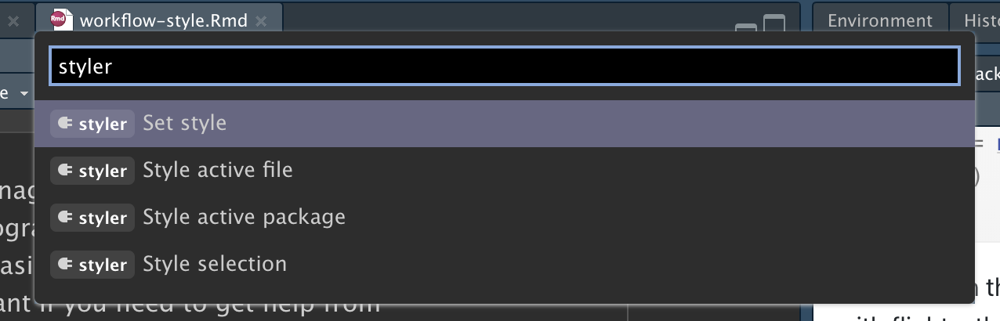

# Flux de travail : style de code {#sec-workflow-style}

```{r}
#| echo: false
source("_common.R")
```

Un bon style de code est comme une ponctuation correcte : vous pouvez vous en passer, mais cela rend les choses beaucoup plus faciles à lire.
Même si vous êtes un programmeur novice, c'est une bonne chose de travailler votre style de code.
L'utilisation d'un style cohérent facilite la lecture de votre travail par d'autres personnes (y compris vous-même dans le futur !) et est particulièrement importante si vous avez besoin de l'aide de quelqu'un d'autre.
Ce chapitre présentera les points les plus importants du [guide de style tidyverse](https://style.tidyverse.org), qui est utilisé tout au long de ce livre.

Mettre en forme votre code vous semblera un peu fastidieux au début, mais avec un peu de pratique, cela deviendra vite une seconde nature.
De plus, il existe d'excellents outils pour remodeler rapidement le code existant, comme le package [**styler**](https://styler.r-lib.org) par Lorenz Walthert.
Une fois que vous l'avez installé avec `install.packages("styler")`, un moyen facile de l'utiliser est via la **palette de commandes** d'RStudio.
La palette de commandes vous permet d'utiliser n'importe quelle commande RStudio intégrée et de nombreux addins fournis par les packages.
Ouvrez la palette en appuyant sur Cmd/Ctrl + Shift + P, puis tapez « styler » pour voir tous les raccourcis offerts par styler.
La @fig-styler montre les résultats.

```{r}
#| label: fig-styler
#| echo: false
#| out-width: null
#| fig-cap: | 
#|   La palette de commandes d'RStudio facilite l'accès à chaque commande
#|   en utilisant uniquement le clavier.
#| fig-alt: |
#|   Capture d'écran montrant la palette de commandes après avoir tapé « styler »,
#|   affichant les quatre outils de style fournis par le package.

```

Nous utiliserons les packages tidyverse et nycflights13 pour les exemples de code dans ce chapitre.

```{r}
#| label: setup
#| message: false
library(tidyverse)
library(nycflights13)
```

## Noms

Nous avons brièvement parlé des noms dans la @sec-whats-in-a-name.
Rappelez-vous que les noms de variables (ceux créés par `<-` et ceux créés par `mutate()`) doivent utiliser uniquement des lettres minuscules, des chiffres et `_`.
Utilisez `_` pour séparer les mots dans un nom.

```{r}
#| eval: false
# Visez ceci :
short_flights <- flights |> filter(air_time < 60)

# Évitez ceci :
SHORTFLIGHTS <- flights |> filter(air_time < 60)
```

En règle générale, il vaut mieux préférer les noms longs et descriptifs qui sont faciles à comprendre plutôt que les noms concis qui sont rapides à taper.
Les noms courts économisent relativement peu de temps lors de l'écriture du code (surtout parce que l'autocomplétion vous aidera à terminer la saisie), mais cela peut prendre du temps quand vous revenez à un ancien code et que vous êtes forcé de démêler une abréviation énigmatique.

Si vous avez beaucoup de noms pour des choses connexes, faites de votre mieux pour être cohérent.
Il est facile que des incohérences surgissent quand vous oubliez une convention précédente, donc ne vous en voulez pas si vous devez revenir en arrière et renommer les choses.
En général, si vous avez beaucoup de variables qui sont des variations d'un même thème, il est préférable de leur donner un préfixe commun plutôt qu'un suffixe commun car l'autocomplétion fonctionne mieux au début d'une variable.

## Espaces

Mettez des espaces de chaque côté des opérateurs mathématiques à l'exception de `^` (c'est-à-dire `+`, `-`, `==`, `<`, ...), et autour de l'opérateur d'affectation (`<-`).

```{r}
#| eval: false
# Visez ceci
z <- (a + b)^2 / d

# Évitez ceci
z<-( a + b ) ^ 2/d
```

Ne mettez pas d'espaces à l'intérieur ou à l'extérieur des parenthèses pour les appels de fonction réguliers.
Mettez toujours un espace après une virgule, comme en français standard.

```{r}
#| eval: false
# Visez ceci
mean(x, na.rm = TRUE)

# Évitez ceci
mean (x ,na.rm=TRUE)
```

Il est possible d'ajouter des espaces supplémentaires si cela améliore l'alignement.
Par exemple, si vous créez plusieurs variables dans `mutate()`, vous pourriez vouloir ajouter des espaces pour que tous les `=` s'alignent.[^workflow-style-1]
Cela rend le code plus facile à parcourir.

[^workflow-style-1]: Puisque `dep_time` est au format `HMM` ou `HHMM`, nous utilisons la division entière (`%/%`) pour obtenir l'heure et le reste (aussi connu sous le nom de modulo, `%%`) pour obtenir les minutes.

```{r}
#| eval: false
flights |> 
  mutate(
    speed      = distance / air_time,
    dep_hour   = dep_time %/% 100,
    dep_minute = dep_time %%  100
  )
```

## Pipes {#sec-pipes}

`|>` devrait toujours avoir un espace avant et devrait généralement être la dernière chose sur une ligne.
Cela rend plus facile l'ajout de nouvelles étapes, la réorganisation des étapes existantes, la modification des éléments dans une étape, et permet d'avoir une vue d'ensemble en parcourant rapidement les verbes affichés à gauche.

```{r}
#| eval: false
# Visez ceci
flights |>  
  filter(!is.na(arr_delay), !is.na(tailnum)) |> 
  count(dest)

# Évitez ceci
flights|>filter(!is.na(arr_delay), !is.na(tailnum))|>count(dest)
```

Si la fonction à laquelle vous transmettez des données via le pipe comporte des arguments nommés (comme `mutate()` ou `summarize()`), mettez chaque argument sur une nouvelle ligne.
Si la fonction n'a pas d'arguments nommés (comme `select()` ou `filter()`), gardez tout sur une ligne sauf si cela ne tient pas, auquel cas vous devriez mettre chaque argument sur sa propre ligne.

```{r}
#| eval: false
# Visez ceci
flights |>  
  group_by(tailnum) |> 
  summarize(
    delay = mean(arr_delay, na.rm = TRUE),
    n = n()
  )

# Évitez ceci
flights |>
  group_by(
    tailnum
  ) |> 
  summarize(delay = mean(arr_delay, na.rm = TRUE), n = n())
```

Après la première étape du pipeline, indentez chaque ligne de deux espaces.
RStudio mettra automatiquement les espaces pour vous après un saut de ligne suivant un `|>`.
Si vous mettez chaque argument sur sa propre ligne, indentez par deux espaces supplémentaires.
Assurez-vous que `)` est sur sa propre ligne, et sans indentation pour correspondre à la position horizontale du nom de la fonction.

```{r}
#| eval: false
# Visez ceci
flights |>  
  group_by(tailnum) |> 
  summarize(
    delay = mean(arr_delay, na.rm = TRUE),
    n = n()
  )

# Évitez ceci
flights|>
  group_by(tailnum) |> 
  summarize(
             delay = mean(arr_delay, na.rm = TRUE), 
             n = n()
           )

# Évitez ceci
flights|>
  group_by(tailnum) |> 
  summarize(
  delay = mean(arr_delay, na.rm = TRUE), 
  n = n()
  )
```

C'est acceptable de contourner certaines de ces règles si votre pipeline tient facilement sur une ligne.
Mais selon notre expérience collective, il est courant que les petits extraits deviennent plus longs, donc vous économiserez généralement du temps à long terme en insérant l'espace vertical dont vous avez besoin au début de la ligne.

```{r}
#| eval: false
# Cela tient compactement sur une ligne
df |> mutate(y = x + 1)

# Bien que cela prenne 4 fois plus de lignes, c'est facilement extensible à 
# plus de variables et plus d'étapes à l'avenir
df |> 
  mutate(
    y = x + 1
  )
```

Enfin, évitez d'écrire de très longs pipelines, disons plus de 10-15 lignes.
Essayez de les diviser en sous-tâches plus petites, en donnant à chaque tâche un nom informatif.
Les noms aideront à indiquer au lecteur ce qui se passe et rendront plus facile la vérification des résultats intermédiaires.
Chaque fois que vous pouvez donner un nom évocateur à quelque chose, vous devriez le faire, par exemple lorsque vous modifiez fondamentalement la structure des données, après un pivot ou un résumé.
Ne vous attendez pas à bien faire du premier coup !
Cela signifie diviser les longs pipelines s'il y a des états intermédiaires qui peuvent obtenir de bons noms.

## ggplot2

Les mêmes règles de base qui s'appliquent au pipe s'appliquent également à ggplot2 ; traitez simplement `+` de la même manière que `|>`.

```{r}
#| eval: false
flights |> 
  group_by(month) |> 
  summarize(
    delay = mean(arr_delay, na.rm = TRUE)
  ) |> 
  ggplot(aes(x = month, y = delay)) +
  geom_point() + 
  geom_line()
```

Encore une fois, si vous ne pouvez pas mettre tous les arguments d'une fonction sur une seule ligne, mettez chaque argument sur sa propre ligne :

```{r}
#| eval: false
flights |> 
  group_by(dest) |> 
  summarize(
    distance = mean(distance),
    speed = mean(distance / air_time, na.rm = TRUE)
  ) |> 
  ggplot(aes(x = distance, y = speed)) +
  geom_smooth(
    method = "loess",
    span = 0.5,
    se = FALSE, 
    color = "white", 
    linewidth = 4
  ) +
  geom_point()
```

Attention à la transition de `|>` à `+`.
Nous aimerions que cette transition ne soit pas nécessaire, mais malheureusement, ggplot2 a été écrit avant la découverte du pipe.

## Commentaires de section

Au fur et à mesure que vos scripts deviennent plus longs, vous pouvez utiliser des commentaires de **section** pour diviser votre fichier en morceaux gérables :

```{r}
#| eval: false
# Charger les données ------------------------------------

# Tracer les données ------------------------------------
```

RStudio fournit un raccourci clavier pour créer ces en-têtes (Cmd/Ctrl + Shift + R), et les affichera dans la liste déroulante de navigation de code en bas à gauche de l'éditeur, comme indiqué dans la @fig-rstudio-sections.

```{r}
#| label: fig-rstudio-sections
#| echo: false
#| out-width: null
#| fig-cap: | 
#|   Après avoir ajouté des commentaires de section à votre script, vous pouvez
#|   facilement naviguer entre eux en utilisant l'outil de navigation de code en bas à gauche de l'éditeur de script.
knitr::include_graphics("screenshots/rstudio-nav.png")
```

## Exercices

1.  Reformatez les pipelines suivants en respectant les directives ci-dessus.

    ```{r}
    #| eval: false
    flights|>filter(dest=="IAH")|>group_by(year,month,day)|>summarize(n=n(),
    delay=mean(arr_delay,na.rm=TRUE))|>filter(n>10)

    flights|>filter(carrier=="UA",dest%in%c("IAH","HOU"),sched_dep_time>
    0900,sched_arr_time<2000)|>group_by(flight)|>summarize(delay=mean(
    arr_delay,na.rm=TRUE),cancelled=sum(is.na(arr_delay)),n=n())|>filter(n>10)
    ```

## Résumé

Dans ce chapitre, vous avez appris les principes les plus importants du style de code.
Ceux-ci peuvent sembler arbitraires au départ (parce que c'est le cas !) mais au fil du temps, à mesure que vous écrivez plus de code et que vous partagez du code avec plus de personnes, vous verrez à quel point un style cohérent est important.
Et n'oubliez pas le package styler : c'est un excellent moyen d'améliorer rapidement la qualité du code mal formaté.

Dans le chapitre suivant, nous revenons aux outils de science des données, en apprenant les données propres (tidy).
Les données propres sont une façon cohérente d'organiser vos data frames qui est utilisée tout au long du tidyverse.
Cette cohérence vous facilite la vie, car une fois que vos données sont propres, elles fonctionnent tout simplement avec la grande majorité des fonctions de tidyverse. 
Bien sûr, la vie n'est jamais facile, et la plupart des jeux de données que vous rencontrerez ne seront pas propres.
Donc nous vous enseignerons aussi comment utiliser le package tidyr pour nettoyer vos données désordonnées.
